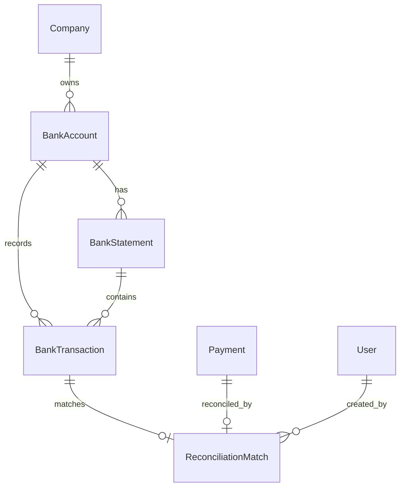

# Phase 13A — Bank Reconciliation Architecture Plan

> Status: **Scoping Plan Only**. No schema, no migrations, no backend code, no frontend code, no tests, no RBAC catalog changes, and no README edits belong to this artefact. Concrete models, migration scripts, controllers, services, DTOs, Jest e2e tests, and frontend views are deferred to the sub-phases listed in section 10. This plan **inherits and is bounded by** Phase 10A/10B (AR/AP Payments), Phase 11B (Real GL Posting), and Phase 12A (Financial Statements).

---

## 1. Goal & Scope of Bank Reconciliation

The Bank Reconciliation module bridges external banking activity with internal accounting records. While Phase 10A/10B tracks cash/bank movements from the commercial side (`Payment` model), and Phase 11B mirrors them in the general ledger (`CASH_OR_BANK` account), Phase 13A introduces the **verification and reconciliation layer** against actual bank statement data.

```text
External Bank (CSV)                 Internal ERP Ledger
┌─────────────────────────┐         ┌───────────────────────────────┐
│ Bank Statement          │         │ AR / AP Payments (Phase 10)   │
│ - Inflows (Credits)     │ ◄─────► │ - Customer Receipts (AR)      │
│ - Outflows (Debits)     │  Match  │ - Supplier Disbursements (AP) │
│ - Fees / Charges        │         │ - GL Posting (Phase 11B)      │
└─────────────────────────┘         └───────────────────────────────┘
```

### 1.1 What Phase 13A Delivers
1. **Bank Account Registry**: Management of company bank accounts linked to the chart of accounts (`CASH_OR_BANK` asset accounts).
2. **Statement Import**: Secure manual CSV statement ingestion with row normalization, structural validation, and duplicate detection.
3. **Transaction Ledger**: Normalized internal representation of statement lines (`BankTransaction`).
4. **Matching Engine**: Deterministic rule-based matching between bank transactions and posted payments:
   - Inbound transactions (Credits) ↔ Posted AR Payments (`SALES`).
   - Outbound transactions (Debits) ↔ Posted AP Payments (`PURCHASE`).
5. **Reconciliation State & Audit**: Audit trail of matched pairs (`ReconciliationMatch`), unmatched payment detection, and unmatched bank movement alerts.
6. **Read-Only Reconciliation Summary & Reports**: Variance analysis between statement ending balance and ledger cash balance.
7. **Frontend Workspace**: Intuitive Arabized workspace for statement upload, match suggestions review, manual matching, and unmatching.

### 1.2 What Phase 13A Explicitly Is Not
- **Not an Automated GL Posting Engine**: Reconciliation does not automatically generate GL journal entries in Phase 13A. GL postings already exist from Phase 11B auto-posting upon payment registration.
- **Not an Open Banking API / Live Feed**: No direct HTTP/REST bank integrations, aggregator webhooks (e.g., Lean, Tarabut), or automated scraping.
- **Not a Multi-Currency System**: Single base currency `SAR` only.
- **Not Bank Fees Auto-Posting**: Bank fees and interest adjustments are detected and surfaced as unmatched movements; automated GL debiting of fee accounts is deferred to a future sub-phase.

---

## 2. Data Model Proposal (Schema Design)

The reconciliation schema operates as an audit and matching layer sitting adjacent to `payments` and `journal_entries`.



### 2.1 Proposed Models

#### 1. `BankAccount`
Represents an authorized bank account owned by a company.
- `id`: String (cuid, primary key)
- `companyId`: String (tenant foreign key, indexed)
- `bankName`: String (e.g., "Al Rajhi Bank", "SNB", "Riyad Bank")
- `accountName`: String (e.g., "Main Operational Account")
- `accountNumber`: String
- `iban`: String (Saudi IBAN: `SA` + 22 alphanumeric characters)
- `currency`: String (default `"SAR"`)
- `glAccountId`: String? (optional foreign key to `Account` with `type: ASSET`, `code: CASH_OR_BANK`)
- `openingBalance`: Decimal (`@db.Decimal(18, 4)`, default `0.0000`)
- `currentBalance`: Decimal (`@db.Decimal(18, 4)`, default `0.0000`)
- `isActive`: Boolean (default `true`)
- `createdAt`, `updatedAt`, `deletedAt`: DateTime audit stamps
- **Constraints**:
  - `@@unique([companyId, iban])`
  - `@@index([companyId, isActive])`

#### 2. `BankStatement`
Represents an uploaded or recorded statement session.
- `id`: String (cuid, primary key)
- `companyId`: String (tenant foreign key)
- `bankAccountId`: String (foreign key to `BankAccount`)
- `statementIdentifier`: String? (e.g., bank statement reference or number)
- `startDate`: DateTime
- `endDate`: DateTime
- `openingBalance`: Decimal (`@db.Decimal(18, 4)`)
- `closingBalance`: Decimal (`@db.Decimal(18, 4)`)
- `totalInflow`: Decimal (`@db.Decimal(18, 4)`)
- `totalOutflow`: Decimal (`@db.Decimal(18, 4)`)
- `rawFileName`: String?
- `fileHash`: String (SHA-256 of uploaded file content to block duplicate statement ingestion)
- `status`: Enum `StatementStatus` (`DRAFT | RECONCILED`)
- `importedAt`: DateTime (default `now()`)
- `importedById`: String? (foreign key to `User`)
- **Constraints**:
  - `@@unique([companyId, fileHash])`
  - `@@index([companyId, bankAccountId, startDate, endDate])`

#### 3. `BankTransaction`
Individual statement lines representing actual bank movements.
- `id`: String (cuid, primary key)
- `companyId`: String (tenant foreign key)
- `bankAccountId`: String (foreign key to `BankAccount`)
- `statementId`: String? (foreign key to `BankStatement`, cascade delete on statement removal)
- `transactionDate`: DateTime (booking date)
- `valueDate`: DateTime? (value date)
- `type`: Enum `BankTransactionType` (`INFLOW | OUTFLOW`)
- `amount`: Decimal (`@db.Decimal(18, 4)`, always positive magnitude)
- `balanceAfter`: Decimal? (`@db.Decimal(18, 4)`)
- `reference`: String? (check number, transaction ID, or transfer memo)
- `description`: String? (narration from the bank)
- `payerPayee`: String? (counterparty name extracted from statement)
- `fingerprint`: String (SHA-256 hash of `[accountNumber, transactionDate, amount, type, reference, balanceAfter]`)
- `status`: Enum `ReconciliationStatus` (`UNMATCHED | MATCHED | EXCLUDED`)
- `createdAt`, `updatedAt`: DateTime
- **Constraints**:
  - `@@unique([companyId, bankAccountId, fingerprint], map: "bank_tx_company_account_fingerprint_uniq")`
  - `@@index([companyId, bankAccountId, transactionDate])`
  - `@@index([companyId, status])`

#### 4. `ReconciliationMatch`
The immutable binding between a `BankTransaction` and an ERP `Payment`.
- `id`: String (cuid, primary key)
- `companyId`: String (tenant foreign key)
- `bankTransactionId`: String (foreign key to `BankTransaction`)
- `paymentId`: String (foreign key to `Payment`)
- `amount`: Decimal (`@db.Decimal(18, 4)`)
- `matchType`: Enum `MatchType` (`EXACT | SUGGESTED | MANUAL`)
- `confidenceScore`: Int? (0–100, populated when suggested by algorithm)
- `notes`: String?
- `matchedAt`: DateTime (default `now()`)
- `matchedById`: String? (foreign key to `User`)
- `unmatchedAt`: DateTime? (populated if match is reversed)
- `unmatchedById`: String?
- **Constraints & Uniqueness**:
  - Initial implementation must enforce one active match per bank transaction and one active match per payment.
  - If the MVP uses hard-delete on unmatch, plain unique constraints are acceptable:
    - `@@unique([companyId, bankTransactionId])`
    - `@@unique([companyId, paymentId])`
  - If soft-unmatch retains historical `ReconciliationMatch` rows, do NOT use plain Prisma `@@unique` for those fields because it would block future re-matching.
  - In soft-unmatch mode, enforce active uniqueness with PostgreSQL partial unique indexes in the migration SQL:
    - `CREATE UNIQUE INDEX reconciliation_match_active_bank_tx_uniq ON reconciliation_matches(company_id, bank_transaction_id) WHERE unmatched_at IS NULL;`
    - `CREATE UNIQUE INDEX reconciliation_match_active_payment_uniq ON reconciliation_matches(company_id, payment_id) WHERE unmatched_at IS NULL;`
  - `@@index([companyId, matchedAt])`

---

## 3. Statement Import Strategy

### 3.1 Manual CSV Parser Specification
In Saudi banking practice, CSV formats vary slightly by bank (e.g., Al Rajhi, Saudi National Bank (SNB), Riyad Bank, Alinma), but all share common columns:
- Transaction Date / Booking Date.
- Reference / Ref Number / Check Number.
- Description / Narration.
- Debit / Credit columns OR Amount + Debit/Credit Flag.
- Running Balance (optional but common).

### 3.2 Import Lifecycle
```text
Raw CSV File
     │
     ▼
[Step 1: Ingestion & Integrity Check]
  - Validate MIME type (text/csv, application/vnd.ms-excel).
  - Enforce file size limit (max 5 MB / ~25,000 rows).
  - Compute SHA-256 file hash; reject if statement already imported.
     │
     ▼
[Step 2: Normalization & Field Mapping]
  - Map column headers (auto-detect or user-selected mapping).
  - Normalize dates to UTC start-of-day (`YYYY-MM-DD`).
  - Normalize money into `Prisma.Decimal` with 4 decimal places.
  - Determine direction:
      Credit / Deposit  --> `type = INFLOW`
      Debit / Withdrawal --> `type = OUTFLOW`
     │
     ▼
[Step 3: Deduplication & Fingerprinting]
  - Compute row fingerprint: `SHA256(companyId + iban + date + amount + type + ref + balance)`.
  - Batch insert with duplicate skip or report duplicate count.
     │
     ▼
[Step 4: Persistence]
  - Save `BankStatement` header and child `BankTransaction` rows in a single `$transaction`.
```

### 3.3 Precision & Safety Rules
- **No Float Arithmetic**: File amounts are trimmed, parsed into pure numeric strings, and instantiated as `new Prisma.Decimal(str)`.
- **Zero-Amount Lines**: Lines with `amount == 0` are skipped.
- **Tenant Protection**: `companyId` is injected strictly from the authenticated JWT.

---

## 4. Matching Engine & Algorithms

### 4.1 Directional Symmetry Rule
The matching logic strictly enforces accounting direction:
| Bank Transaction | Direction | Corresponding ERP Record | Reason |
|---|---|---|---|
| **INFLOW** (Deposit / Credit) | Inbound | `Payment` where `invoiceType === 'SALES'` (`AR_PAYMENT`) | Customer pays cash/bank into company account |
| **OUTFLOW** (Withdrawal / Debit) | Outbound | `Payment` where `invoiceType === 'PURCHASE'` (`AP_PAYMENT`) | Company disburses funds to supplier |

Transactions and payments with mismatched directions are strictly incompatible.

### 4.2 Deterministic Matching Scoring (0–100)
When evaluating candidates for a `BankTransaction`, the engine ranks potential `Payment` records based on:

1. **Amount Match (60 Points)**:
   - `bankTx.amount.equals(payment.amount)` $\rightarrow$ 60 points.
   - Any difference in amount $\rightarrow$ 0 points (one-to-one phase does not guess partial amounts).

2. **Date Proximity (25 Points)**:
   - Exact same date (`bankTx.transactionDate === payment.paidAt` UTC day) $\rightarrow$ 25 points.
   - $\pm 1$ day difference $\rightarrow$ 20 points.
   - $\pm 2$ days difference $\rightarrow$ 15 points.
   - $\pm 3$ to $5$ days difference $\rightarrow$ 10 points.
   - $> 5$ days difference $\rightarrow$ 0 points.

3. **Reference / Textual Similarity (15 Points)**:
   - Exact reference match (`bankTx.reference === payment.reference`) $\rightarrow$ 15 points.
   - Partial substring match (invoice number or partner code in bank description) $\rightarrow$ 10 points.
   - No reference match $\rightarrow$ 0 points.

### 4.3 Match Categorization
- **Exact Match (Score = 100)**: Identical amount, identical date, identical reference. Recommended for 1-click batch approval.
- **High Confidence ($80 \le \text{Score} < 100$)**: Identical amount and close date window. Displayed as suggested matches.
- **Low / Ambiguous ($\text{Score} < 80$)**: Requires manual review.
- **Unmatched Movements**:
  - Bank transactions without matching ERP payments (e.g., bank charges, unrecorded transfers).
  - ERP payments without matching bank transactions (e.g., uncleared checks, in-transit deposits).

### 4.4 Unmatching Workflow
- Either party may unmatch an active pair.
- The `ReconciliationMatch` is marked as inactive/unmatched with `unmatchedAt` and `unmatchedById`, or hard-deleted in the MVP if audit history is separately captured.
- The `BankTransaction` returns to `UNMATCHED` status.
- The `Payment.status` remains unchanged (`POSTED`); reconciliation state is derived from active `ReconciliationMatch` rows.
- Posted `JournalEntry` and `JournalEntryLine` records remain completely untouched.

---

## 5. Accounting & Ledger Integration

### 5.1 Invariant: Separation of Reconciliation and GL Writes
Reconciliation in Phase 13A is an **audit and proof mechanism**, not a double-entry posting event:
1. **GL Postings Already Exist**: When payments are created in Phase 10A/10B, Phase 11B auto-posts them to the GL (`postArPaymentPosted`, `postApPaymentPosted`).
2. **No Double-Posting**: Matching a bank transaction to a payment must **never** create a second journal entry.
3. **No In-Place Mutation of Journals**: Neither `JournalEntry` nor `JournalEntryLine` is altered or cancelled upon reconciliation.
4. **Reconciliation Status Is Independent**: `Payment.status` stays `POSTED`; its reconciliation status is derived by joining `ReconciliationMatch`.

### 5.2 Bank Balance vs. Book Balance
The reconciliation engine calculates the three core balances for any reporting date:
$$\text{Reconciled Balance} = \text{Bank Statement Ending Balance} - \text{Uncleared Payments} + \text{Deposits in Transit}$$
- **GL Book Balance**: Sum of all POSTED lines on the mapped `CASH_OR_BANK` account.
- **Bank Statement Balance**: Statement closing balance reported by the financial institution.
- **Variance / Discrepancy**: $\text{GL Book Balance} - \text{Reconciled Bank Balance}$.

---

## 6. API Proposals (Endpoints & Contracts)

All endpoints reside under the `/api/reconciliation` prefix and are gated by RBAC.

| Method | Route | Permission | Description |
|---|---|---|---|
| `GET` | `/api/reconciliation/bank-accounts` | `reconciliation.read` | List active bank accounts with current balances |
| `POST` | `/api/reconciliation/bank-accounts` | `reconciliation.write` | Create a new company bank account |
| `PATCH` | `/api/reconciliation/bank-accounts/:id` | `reconciliation.write` | Update bank account details (name, GL account linkage) |
| `POST` | `/api/reconciliation/statements/import-csv` | `reconciliation.import` | Ingest CSV statement file (multipart/form-data) |
| `GET` | `/api/reconciliation/bank-transactions` | `reconciliation.read` | Filter bank transactions (by account, date, status) |
| `GET` | `/api/reconciliation/suggestions` | `reconciliation.read` | Fetch suggested matches for unmatched transactions |
| `POST` | `/api/reconciliation/matches` | `reconciliation.write` | Confirm a match between transaction and payment |
| `DELETE` | `/api/reconciliation/matches/:id` | `reconciliation.write` | Unmatch an existing pair |
| `GET` | `/api/reconciliation/reports/summary` | `reconciliation.read` | Bank vs. Book balance comparison & variance |
| `GET` | `/api/reconciliation/reports/unmatched` | `reconciliation.read` | List unmatched bank movements & uncollected payments |

### 6.1 Sample Payload Contract: Match Creation
```json
// POST /api/reconciliation/matches
{
  "bankTransactionId": "cltx...",
  "paymentId": "clpx...",
  "matchType": "MANUAL",
  "notes": "Verified against deposit receipt #4821"
}
```

Response:
```json
{
  "status": "ok",
  "companyId": "comp-123",
  "data": {
    "matchId": "clmx...",
    "bankTransactionId": "cltx...",
    "paymentId": "clpx...",
    "amount": "1500.0000",
    "matchedAt": "2026-09-10T12:00:00.000Z"
  }
}
```

---

## 7. Frontend Architecture Proposal

A dedicated module at `/accounting/reconciliation` with standard Arabized UI and permission protection.

### 7.1 Views & Components
1. **Header & Account Selector**:
   - Selector dropdown to pick active `BankAccount`.
   - KPI Banner: Statement Balance, GL Cash Balance, Reconciled %, Unmatched Items Count.
2. **Statement Ingestion Modal / Tab**:
   - File upload dropzone with client-side CSV validation.
   - Column mapping selector (Date, Debit, Credit, Reference, Description).
   - Ingestion summary preview before saving.
3. **Reconciliation Workspace (Split View / Tabs)**:
   - **Left Panel (Bank Statement)**: Unmatched bank transactions with amount, date, reference, and "Match" button.
   - **Right Panel (System Payments)**: Unmatched AR/AP payments with corresponding amounts and dates.
   - **Suggested Matches Queue**: Card list showing high-confidence pairs with match score badges and "Approve Match" button.
4. **Reconciliation Summary Report**:
   - Printable screen comparing Statement Balance vs. GL Account Balance with itemized variance.

---

## 8. RBAC Proposal

Three dedicated permission catalog keys:
- **`reconciliation.read`**: Allows viewing bank accounts, statement lines, matches, and reconciliation reports.
- **`reconciliation.write`**: Allows creating and unlinking matches, and configuring bank account parameters.
- **`reconciliation.import`**: Allows uploading and committing bank statement files.

> *Note: Actual database migration and seed insertion for RBAC catalog keys are out of scope for this plan and belong to implementation sub-phase 13A-B-1.*

---

## 9. Explicit Out of Scope

The following capabilities are deliberately excluded from Phase 13A:
- ❌ **Direct Open Banking APIs**: No OAuth2 or REST integrations with Saudi banks.
- ❌ **Automated GL Fee Posting**: Bank charges do not automatically create journal entries.
- ❌ **Multi-Currency Reconciliation**: Currency is strictly `SAR`.
- ❌ **Many-to-Many Matching**: Phase 13A focuses strictly on one-to-one matching; many-to-one (batch deposits) is deferred.
- ❌ **Real-Time Webhook Ingestion**: No background push listener.
- ❌ **Tax / ZATCA Filing**: Reconciliation does not affect VAT reporting.
- ❌ **Production Cloud Deployment**: Localhost / Docker Compose only.
- ❌ **PDF / Excel Export**: Formats remain on-screen HTML/React tables.

---

## 10. Recommended Sub-Phases (Single-Domain Delivery)

Following our strict single-domain commit discipline, Phase 13A will be executed across the following sub-phases:

| Sub-Phase | Domain | Deliverables | Commit Message |
|---|---|---|---|
| **13A-PLAN** | Planning | Architectural document (`docs/PHASE_13A_RECONCILIATION_PLAN.md`) | `docs(phase-13a): add reconciliation architecture plan` |
| **13A-B-1** | Schema & RBAC | Prisma models (`BankAccount`, `BankStatement`, `BankTransaction`, `ReconciliationMatch`), migration, and RBAC catalog keys | `feat(phase-13a): add reconciliation models and permissions` |
| **13A-B-2** | Service Skeleton | `ReconciliationModule`, `BankAccountService`, and basic CRUD controller | `feat(phase-13a): add bank accounts and reconciliation skeleton` |
| **13A-B-3** | CSV Ingestion | CSV parser, format normalization, and SHA-256 duplicate detection | `feat(phase-13a): implement bank statement csv import parser` |
| **13A-B-4** | Matching Engine | Deterministic scoring algorithm and match suggestion queries | `feat(phase-13a): implement reconciliation matching engine` |
| **13A-B-5** | Match Workflow | Manual match & unmatch transactions, status lifecycle, and constraints | `feat(phase-13a): implement manual match and unmatch workflow` |
| **13A-B-6** | Reports & e2e | Unmatched reports endpoint + Jest e2e test suite | `test(phase-13a): add reconciliation reports and e2e tests` |
| **13A-C** | Frontend UI | Workspace at `/accounting/reconciliation`, import modal, and match review | `feat(phase-13a): add frontend reconciliation workspace` |
| **13A-D-1** | Verification | Verification of backend build, frontend build, and e2e test suite (no commit) | *None* |
| **13A-D-2** | Closure | Documentation of Phase 13A in `README.md` | `docs(phase-13a): update README for reconciliation closure` |
