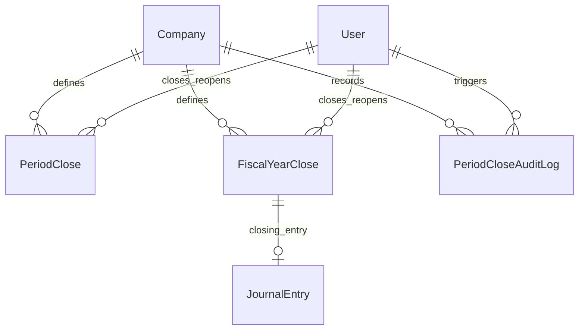

# Phase 14A: Period Close / Fiscal Closing Architecture Plan

> Status: **Scoping Plan Only**. No schema changes, no migrations, no backend code, no frontend code, no tests, no RBAC catalog seed changes, and no README edits belong to this planning phase. Concrete models, migration scripts, controllers, services, DTOs, Jest e2e tests, and frontend views are deferred to the sub-phases listed in section 14. This plan **inherits and is bounded by** Phase 10A/10B (AR/AP Payments), Phase 11B (Real GL Auto-Posting), Phase 12A (Financial Statements), and Phase 13A (Bank Reconciliation).

---

## 1. Purpose and Scope

Phase 14A introduces a controlled financial **Period Close and Fiscal Year Closing** architecture layer to the ERP system.

As an ERP matures, accounting data integrity relies on the ability to permanently lock historical financial periods. Without period locking, users or automated background processes could post, edit, backdate, or cancel journal entries in past periods, distorting audited financial statements, tax reports, and reconciled bank accounts.

### Scope Includes:
1. **Monthly / Accounting Period Closing**: Administrative control to lock arbitrary or calendar/monthly accounting periods (`periodStart` to `periodEnd`).
2. **Fiscal Year Closing**: Year-end financial closing workflow spanning the company's fiscal year window (`fiscalYearStart` to `fiscalYearEnd`).
3. **Posting & Mutation Guards**: Server-side prevention of creating, posting, modifying, backdating, reversing, or cancelling `JournalEntry` records whose effective `entryDate` falls inside a closed period.
4. **Read-Only Close Status Visibility**: Status querying endpoints and dashboards allowing accountants and managers to inspect the open/closed status of periods.
5. **Controlled Reopen Workflow**: Strict, permission-gated workflow allowing authorized administrators to reopen a closed period with a mandatory justification reason and full audit logging.
6. **Immutable Audit Trail**: Tracking of all close, reopen, validation failure, and override actions in a dedicated audit log table (`PeriodCloseAuditLog`).
7. **Retained Earnings Closing Entry Architecture**: Design and guardrails for future automated year-end transfer of nominal revenue/expense balances to retained earnings equity accounts.
8. **Inter-Module Integration**: Seamless enforcement across General Ledger (`JournalEntry`), Commercial Settlement (`Payment`), Financial Statements (`TrialBalance`, `IncomeStatement`, `BalanceSheet`), and Bank Reconciliation (`Reconciliation`).

### Scope Exclusions (This Phase):
- **Planning Only**: This document defines architecture, contracts, invariants, and implementation roadmaps. No code, schema, or test files are altered in Phase 14A-PLAN.

---

## 2. Current Accounting Baseline

The system already possesses a robust, balanced double-entry accounting and verification core:

1. **General Ledger Posting (Phase 6 & Phase 11B)**:
   - Double-entry debits and credits exist via `JournalEntry` and `JournalEntryLine`.
   - Real-time automated posting triggers on commercial milestones: `SalesInvoice ISSUED`, `PurchaseInvoice RECEIVED`, `AR Payment POSTED`, and `AP Payment POSTED`.
   - Idempotent and balanced: enforces `totalDebit == totalCredit` and prevents duplicate postings via `@@unique([companyId, sourceType, sourceId])`.
2. **Financial Reporting (Phase 12A)**:
   - Three core financial statements exist under `/api/accounting/reports`:
     - `GET /api/accounting/reports/trial-balance`
     - `GET /api/accounting/reports/income-statement`
     - `GET /api/accounting/reports/balance-sheet`
   - Reports read **`JournalEntryStatus.POSTED`** rows only, filtered by `JournalEntry.entryDate`.
   - The Balance Sheet dynamically computes synthetic equity (`retainedEarningsComputed` and `currentPeriodNetIncome`) from historical posted nominal lines.
3. **Bank Reconciliation (Phase 13A)**:
   - Resides under `/api/reconciliation` and `/accounting/reconciliation`.
   - Ingests external bank statements via CSV and matches bank movements to posted ERP payments.
   - **Crucial Invariant**: Reconciliation does not create GL journal entries and does not mutate `Payment.status` (`Payment.status` remains `POSTED`).
4. **Immutability Baseline**:
   - Posted journal entries cannot be edited in place. They can only be cancelled or reversed through explicit reverse journal entries.
   - However, currently there is **no temporal restriction** preventing a new journal entry from being dated in a previous month or year, nor preventing an old draft from being posted into a past period.

---

## 3. Key Invariants

Any implementation of Phase 14A must uphold the following non-negotiable architectural invariants:

1. **Strict Date Range Locking**:
   - If a period `[periodStart, periodEnd]` is `CLOSED`, no `JournalEntry` with `entryDate` within that range may be transitioned to `POSTED`.
   - Any attempt to post, create a posted entry, backdate an entry, or cancel/reverse an entry effective within a closed period must be rejected with HTTP 409 (`ConflictException`).
2. **Reproducibility of Historical Statements**:
   - Financial statements (`TrialBalance`, `IncomeStatement`, `BalanceSheet`) generated for a closed period must remain strictly immutable and reproducible over time.
3. **Zero Silent Mutations**:
   - Closing or reopening a period must never silently alter existing `JournalEntry`, `JournalEntryLine`, or `Payment` records.
4. **Decoupled Reconciliation & Payment Status**:
   - `Payment.status` must never be repurposed as period close status.
   - Reconciliation matching and unmatching remains permitted regardless of period close status because reconciliation does not generate or alter general ledger postings.
5. **Tenant Isolation**:
   - All period close configurations, status checks, and audit logs are strictly isolated by `companyId` extracted from the authenticated user's JWT. Cross-tenant inspection or locking is impossible.
6. **Decimal Precision**:
   - All monetary validations (e.g. verifying trial balance debit/credit equality before closing) use `Prisma.Decimal`. The JavaScript primitive `Number()` is forbidden for accounting calculations.
7. **Controlled Reopen Integrity**:
   - Reopening a period requires high-level authorization (`period_close.reopen`), a mandatory non-empty justification string, and immediate logging to the immutable audit trail.

---

## 4. Proposed Data Model

The proposed schema introduces three dedicated models into `backend/prisma/schema.prisma`. *(Note: Not implemented in this plan phase; deferred to Phase 14A-B-1)*.



### 4.1 Enums

```prisma
enum PeriodCloseStatus {
  OPEN
  CLOSING
  CLOSED
  REOPENED
}

enum PeriodCloseAction {
  CLOSE_STARTED
  CLOSED
  REOPENED
  FAILED_VALIDATION
}
```

### 4.2 Proposed Prisma Models

#### 1. `PeriodClose`
Represents an accounting period (e.g. calendar month) and its closure lifecycle:
- `id`: String (cuid, primary key)
- `companyId`: String (indexed foreign key to `Company`)
- `fiscalYear`: Int (e.g., `2026`)
- `periodNumber`: Int (e.g., `1` to `12` for monthly periods, or `13` for adjusting period)
- `periodStart`: DateTime (`@db.Date` or `@db.Timestamptz`, start of period, e.g. `2026-01-01T00:00:00.000Z`)
- `periodEnd`: DateTime (`@db.Date` or `@db.Timestamptz`, end of period, e.g. `2026-01-31T23:59:59.999Z`)
- `status`: PeriodCloseStatus (default `OPEN`)
- `closedAt`: DateTime?
- `closedById`: String? (relation to `User`)
- `reopenedAt`: DateTime?
- `reopenedById`: String? (relation to `User`)
- `reopenReason`: String? (`@db.VarChar(1024)`)
- `notes`: String? (`@db.VarChar(1024)`)
- `createdAt`: DateTime (default `now()`)
- `updatedAt`: DateTime (updated at)
- **Constraints**:
  - `@@unique([companyId, periodStart, periodEnd])`
  - `@@index([companyId, status])`
  - `@@index([companyId, fiscalYear])`

#### 2. `FiscalYearClose`
Represents the annual fiscal closing lifecycle:
- `id`: String (cuid, primary key)
- `companyId`: String (indexed foreign key to `Company`)
- `fiscalYear`: Int (e.g., `2026`)
- `fiscalYearStart`: DateTime (e.g., `2026-01-01T00:00:00.000Z`)
- `fiscalYearEnd`: DateTime (e.g., `2026-12-31T23:59:59.999Z`)
- `status`: PeriodCloseStatus (default `OPEN`)
- `retainedEarningsJournalEntryId`: String? (optional foreign key to `JournalEntry` for closing entry)
- `closedAt`: DateTime?
- `closedById`: String? (relation to `User`)
- `reopenedAt`: DateTime?
- `reopenedById`: String? (relation to `User`)
- `reopenReason`: String? (`@db.VarChar(1024)`)
- `notes`: String? (`@db.VarChar(1024)`)
- `createdAt`: DateTime (default `now()`)
- `updatedAt`: DateTime (updated at)
- **Constraints**:
  - `@@unique([companyId, fiscalYear])`
  - `@@index([companyId, status])`

#### 3. `PeriodCloseAuditLog`
Immutable event log for compliance and security auditing:
- `id`: String (cuid, primary key)
- `companyId`: String (indexed foreign key to `Company`)
- `periodCloseId`: String? (optional foreign key to `PeriodClose`)
- `fiscalYearCloseId`: String? (optional foreign key to `FiscalYearClose`)
- `action`: PeriodCloseAction (CLOSE_STARTED, CLOSED, REOPENED, FAILED_VALIDATION)
- `actorUserId`: String (foreign key to `User`)
- `reason`: String? (`@db.VarChar(1024)`)
- `metadata`: Json? (details of pre-close validation checks, debit/credit totals, etc.)
- `createdAt`: DateTime (default `now()`)
- **Constraints**:
  - `@@index([companyId, createdAt])`
  - `@@index([companyId, periodCloseId])`

---

## 5. Close Status Semantics

### Status Definitions:
- **`OPEN`**:
  - Standard operational state.
  - Normal journal entry creation, posting, cancellation, and commercial auto-posting are allowed.
- **`CLOSING`**:
  - Optional transient state used while backend validation checks or heavy year-end calculations are executing.
  - While in `CLOSING`, posting into the date range is temporarily blocked to prevent race conditions.
- **`CLOSED`**:
  - Fully locked state.
  - All posting, backdating, voiding, or reversing of journal entries effective within `[periodStart, periodEnd]` is blocked server-side.
- **`REOPENED`**:
  - Denotes that a period was previously closed and subsequently unlocked by an authorized user.

### State Transition & Enforcement Recommendation:
To prevent ambiguous operational states, the architectural recommendation is:
- Use **`CLOSED`** and **`OPEN`** as the two primary operational gates for posting enforcement.
- When an administrator reopens a period, update the operational status to **`OPEN`** (or flag it as reopened via `reopenedAt != null`), and log the `REOPENED` event into `PeriodCloseAuditLog` with the required `reopenReason`.
- This ensures downstream posting guards only need to evaluate a simple boolean check: `isDateWithinClosedPeriod(companyId, entryDate)`.

---

## 6. Validation Rules Before Closing

Before an accounting period or fiscal year can be locked, the backend must execute a comprehensive pre-close validation suite. If any mandatory check fails, the period close operation aborts, status remains `OPEN`, and a `FAILED_VALIDATION` audit entry is created.

### 6.1 Period Close Validations (Monthly):
1. **Balanced General Ledger**:
   - Sum of debits must equal sum of credits for all posted journal entries in the period (`totalDebit.equals(totalCredit)`).
2. **No Pending Drafts**:
   - Zero `JournalEntry` records with `status: DRAFT` within `[periodStart, periodEnd]`. All drafts must either be posted or cancelled.
3. **No Unposted Commercial Milestones**:
   - Verify that all commercial invoices (`SalesInvoice` issued, `PurchaseInvoice` received) and settled payments (`Payment` posted) in the date range have corresponding `JournalEntry` records.
4. **Trial Balance Integrity**:
   - Generating `getTrialBalance` for the period produces `totals.balanced === true`.
5. **Non-Blocking Warnings (Surfaced in UI/API, but not blocking MVP close)**:
   - Unreconciled bank transactions (`BankTransaction` status `UNMATCHED`).
   - Unmatched AR/AP payments.
   - Pending aging balances.

### 6.2 Fiscal Year Close Validations (Annual):
1. **Sub-Periods Sealed**:
   - All underlying monthly periods (e.g. periods 1 through 12) for that fiscal year must already be in `CLOSED` status.
2. **Net Income Verification**:
   - `IncomeStatement` net income for the fiscal year must be completely calculated and match the synthetic `currentPeriodNetIncome` on the `BalanceSheet`.
3. **Balance Sheet Equation Validation**:
   - `Assets == Liabilities + Equity + Synthetic Retained Earnings`.
4. **Retained Earnings Guard**:
   - If an automated closing entry is enabled, the target retained earnings equity account must be active in the chart of accounts.

---

## 7. Posting Guard Strategy

The posting guard is the critical enforcement mechanism preventing historical data corruption.

### 7.1 Guard Interception Points
Posting guards must be enforced server-side inside:
1. `AccountingService.postJournalEntry`: Direct manual journal posting.
2. `AccountingService.createJournalEntry`: If direct posting is requested.
3. `AccountingService.cancelJournalEntry`: Cancelling an entry.
4. `SalesService.issue`: Commercial auto-posting of sales invoices.
5. `PurchasesService.receive`: Commercial auto-posting of purchase invoices.
6. `PaymentsService.register` / `registerPurchasePayment`: Commercial auto-posting of payments.
7. Any future GL transaction, reversal, or adjustment endpoints.

### 7.2 Guard Implementation Logic
```typescript
async function assertPeriodIsOpen(
  prisma: PrismaService,
  companyId: string,
  entryDate: Date,
): Promise<void> {
  const closedPeriod = await prisma.periodClose.findFirst({
    where: {
      companyId,
      status: 'CLOSED',
      periodStart: { lte: entryDate },
      periodEnd: { gte: entryDate },
    },
  });

  if (closedPeriod) {
    throw new ConflictException(
      `Cannot post or modify transactions in closed accounting period ` +
      `(${closedPeriod.periodStart.toISOString().slice(0, 10)} to ` +
      `${closedPeriod.periodEnd.toISOString().slice(0, 10)}). ` +
      `The period must be reopened before posting.`,
    );
  }
}
```

### 7.3 Unaffected Modules:
- **Read-Only Reporting**: `TrialBalance`, `IncomeStatement`, `BalanceSheet`, and `Reports` can freely query closed periods.
- **Bank Reconciliation**: Ingestion of CSV statements and manual matching/unmatching do NOT post to the GL and therefore are **not blocked** by period close.

---

## 8. Retained Earnings / Year-End Close Design

A central dilemma in accounting software is how year-end closing entries interact with ongoing financial statement generation.

### 8.1 Current MVP State (Phase 12A)
The existing `BalanceSheetService` synthesizes retained earnings on the fly:
- `RETAINED_EARNINGS_COMPUTED`: Sum of all revenue minus expense lines before the current fiscal year start.
- `CURRENT_PERIOD_NET_INCOME`: Net income of the current fiscal year.
- **Advantage**: Real-time accuracy without needing to post closing journal entries.

### 8.2 Future Year-End Close Design
When closing a fiscal year:
1. **Closing Journal Entry Generation**:
   - A special `JournalEntry` of `sourceType: YEAR_END_CLOSE` is created.
   - It debits total revenues and credits total expenses (zeroing out nominal accounts), transferring the net balance to the designated `RETAINED_EARNINGS` equity account.
2. **Double-Counting Prevention (Crucial Guardrail)**:
   - If a year-end closing entry is posted, the `BalanceSheetService` must **not** re-calculate synthetic net income for that closed year, otherwise retained earnings would be doubled.
   - **Architectural Recommendation for MVP Phase 14A**:
     - Implement **period and fiscal year locking first** without auto-posting closing entries.
     - The Balance Sheet continues its proven, tested synthetic equity calculation.
     - Automated journal-based retained earnings posting is scheduled for a separate follow-up sub-phase once formal chart-of-accounts year-end configuration is complete.

---

## 9. API Proposal

Endpoints reside under `/api/accounting/period-close`:

### 9.1 Monthly Period Endpoints
- `GET /api/accounting/period-close/status`: Quick check of current open period and latest closed period.
- `GET /api/accounting/period-close/periods?fiscalYear=2026`: List all accounting periods for a fiscal year with status, dates, and closing metadata.
- `POST /api/accounting/period-close/periods/close`:
  - Request body: `{ periodStart: string, periodEnd: string, notes?: string }`
  - Runs pre-close validation. If valid, marks period as `CLOSED`.
- `POST /api/accounting/period-close/periods/:id/reopen`:
  - Request body: `{ reason: string }`
  - Requires `reason.length >= 10`. Sets status to `OPEN` and logs audit entry.

### 9.2 Fiscal Year Endpoints
- `GET /api/accounting/period-close/fiscal-years`: List all fiscal years and their status.
- `POST /api/accounting/period-close/fiscal-years/close`:
  - Request body: `{ fiscalYear: number, notes?: string }`
  - Validates that all sub-periods are closed and locks the fiscal year.
- `POST /api/accounting/period-close/fiscal-years/:id/reopen`:
  - Request body: `{ reason: string }`

### 9.3 Audit Trail Endpoint
- `GET /api/accounting/period-close/audit-log?limit=50`: Returns paginated history of close/reopen events.

### 9.4 Response Standard:
All endpoints return the uniform ERP envelope:
```json
{
  "status": "ok",
  "companyId": "cmp_xxx",
  "data": { ... }
}
```

---

## 10. RBAC Proposal

Three distinct, dedicated permissions will be introduced:
1. **`period_close.read`**:
   - Inspect period close status, period lists, fiscal year lists, pre-close validation checklists, and audit logs.
   - Granted to: `ADMIN`, `ACCOUNTANT`, `AUDITOR`.
2. **`period_close.close`**:
   - Trigger monthly period closing and fiscal year closing.
   - Granted to: `ADMIN`, `CHIEF_ACCOUNTANT`.
3. **`period_close.reopen`**:
   - Reopen a previously closed period or fiscal year. Highly restricted.
   - Granted to: `ADMIN` only.

*Note: Implementation of permissions is deferred to future migration phases; no changes to seed or database catalog in this planning phase.*

---

## 11. Frontend Proposal

A dedicated management view at `/accounting/period-close`:

### UI Components:
1. **Fiscal Year & Period Grid**:
   - Cards/table showing periods (Jan – Dec) with clear badges: `مفتوحة / OPEN` (Green), `مغلقة / CLOSED` (Gray/Lock), `معاد فتحها / REOPENED` (Amber).
2. **Pre-Close Validation Checklist**:
   - Visual inspection displaying checkmarks for balanced GL, zero unposted drafts, and trial balance verification.
3. **Close Period Modal**:
   - Confirmation dialog explaining that posting into the selected range will be locked.
4. **Reopen Period Modal**:
   - Explicit confirmation requiring the user to type a required reason (`reason >= 10 chars`) before enabling the unlock button.
5. **Quick Links to Financial Statements**:
   - Direct button links to `/accounting/reports` filtered to the exact dates of the selected period.
6. **Audit Trail Drawer / Section**:
   - Chronological table showing who closed/reopened which period, timestamp, and stated reason.

---

## 12. Integration With Existing Modules

| Module | Interaction with Period Close |
|---|---|
| **General Ledger (`AccountingModule`)** | Enforces `assertPeriodIsOpen` before posting any `JournalEntry`. |
| **Financial Statements (`ReportsModule`)** | Completely read-only. Seamlessly queries closed periods with guaranteed reproducibility. |
| **Sales (`SalesModule`)** | When issuing an invoice, if `issueDate` is in a closed period, rejects with HTTP 409. |
| **Purchases (`PurchasesModule`)** | When receiving an invoice, if `receivedAt` is in a closed period, rejects with HTTP 409. |
| **Payments (`PaymentsModule`)** | When registering a payment, if `paidAt` is in a closed period, rejects with HTTP 409. |
| **Reconciliation (`ReconciliationModule`)** | CSV statement imports and matching/unmatching are permitted without GL guards. Future bank fee postings must respect period close. |

---

## 13. Out of Scope

The following items are explicitly **out of scope** for Phase 14A:
- ❌ **Automated Retained Earnings Posting in Initial Skeleton**: Kept synthetic in Balance Sheet to maintain verified reporting stability.
- ❌ **Editing Historical Posted Journals**: Period close freezes history; it does not introduce retroactive edit capabilities.
- ❌ **Inventory Periodic Costing Lock**: Inventory valuation adjustments remain in inventory module scope.
- ❌ **Payroll Period Close**: HR/Payroll is not yet part of the ERP core.
- ❌ **Tax / ZATCA Phase 2 Submission Locking**: ZATCA integration will have its own cryptographic ledger invariants.
- ❌ **Multi-Currency Revaluation**: All balances remain single-currency `SAR`.
- ❌ **Automated Bank Fee Journal Creation**: Handled in future reconciliation enhancement.
- ❌ **Exporting Reports to PDF or Excel**.
- ❌ **AI-driven Period Closing Validation**.
- ❌ **Any schema migration, code edit, or seed change during this planning phase**.

---

## 14. Recommended Sub-Phases

The recommended implementation breakdown for Phase 14A:

- **Phase 14A-B-1**: Schema and RBAC skeleton for `PeriodClose`, `FiscalYearClose`, `PeriodCloseAuditLog`, and permissions.
  - Commit: `feat(phase-14a): add period close schema and permissions`
- **Phase 14A-B-2**: Backend module skeleton and read-only close status endpoints.
  - Commit: `feat(phase-14a): add period close backend skeleton`
- **Phase 14A-B-3**: Period close validation service (checks for balanced entries, zero drafts, trial balance match).
  - Commit: `feat(phase-14a): implement period close validation`
- **Phase 14A-B-4**: Close and reopen workflow with audit logging.
  - Commit: `feat(phase-14a): implement period close workflow`
- **Phase 14A-B-5**: Server-side posting guards for GL and commercial/payment-generated journals.
  - Commit: `feat(phase-14a): enforce closed period posting guards`
- **Phase 14A-B-6**: Fiscal year close planning and retained earnings guardrails.
  - Commit: `feat(phase-14a): add fiscal year close guardrails`
- **Phase 14A-C**: Frontend period close workspace (`/accounting/period-close`).
  - Commit: `feat(phase-14a): add period close frontend view`
- **Phase 14A-D-1**: Final verification (Prisma generate, backend build, 207+ e2e tests, frontend build).
  - No commit unless fixes required.
- **Phase 14A-D-2**: README closure.
  - Commit: `docs(phase-14a): update README for period close closure`

---

## 15. Verification Expectations

During implementation phases (14A-B-1 through 14A-D-2), the following test and build commands must pass with zero errors:
```bash
pnpm --filter @erp/backend prisma:generate
pnpm --filter @erp/backend build
pnpm --filter @erp/backend test:e2e
pnpm --filter @erp/frontend build
```
In this planning phase (Phase 14A-PLAN), no builds or tests are altered because only this documentation file is written.

---

## 16. Plan Closure Checklist

Before committing this plan:
- [x] Only `docs/PHASE_14A_PERIOD_CLOSE_PLAN.md` is created/modified.
- [x] `git diff --name-only` confirms only the plan document.
- [x] No backend files changed.
- [x] No frontend files changed.
- [x] No Prisma schema or migration changed.
- [x] No README changed.
- [x] No tests changed.
- [x] No RBAC seed changed.
