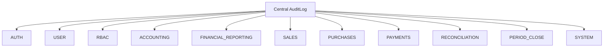
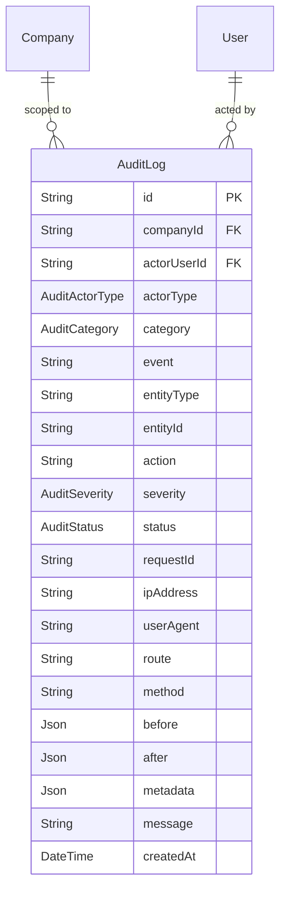

# Phase 15A: Audit Trail / Activity Log Architecture Plan

> Status: **Scoping Plan Only**. No schema changes, no migrations, no backend code, no frontend code, no tests, no RBAC catalog seed changes, and no README edits belong to this planning phase. Concrete models, migration scripts, controllers, services, DTOs, Jest e2e tests, and frontend views are deferred to the sub-phases listed in section 13. This plan **inherits and is bounded by** Phase 10A/10B (AR/AP Payments), Phase 11B (Real GL Auto-Posting), Phase 12A (Financial Statements), Phase 13A (Bank Reconciliation), and Phase 14A (Period Close / Fiscal Closing).

---

## 1. Purpose and Scope

Phase 15A introduces a unified, enterprise-grade **Centralized Audit Trail & Activity Log** architecture layer for the ERP system.

In enterprise and financial systems, accountability, compliance, fraud prevention, forensic auditing, and operational observability require an immutable, tamper-resistant log of who did what, when, to which record, and with what outcome. While individual modules may implement specialized local history (such as `PeriodCloseAuditLog` introduced in Phase 14A), enterprise governance requires a standardized, queryable, tenant-scoped audit logging service that captures events across all operational domains.

### Scope Includes:
1. **Centralized User & System Activity Logging**: Comprehensive tracking of user actions, administrative interventions, automated background processes, and external integrations across sensitive business workflows.
2. **Immutable Append-Only Audit Records**: Write-once, read-only event storage designed to prevent tampering, deletion, or backdated alterations.
3. **Multi-Tenant Isolation**: Rigorous tenant scoping by `companyId` for all business events, while supporting nullable `companyId` strictly for platform-level authentication/system events before company resolution.
4. **Standardized Event Taxonomy**: A consistent, strongly typed classification hierarchy spanning `AUTH`, `USER`, `RBAC`, `ACCOUNTING`, `FINANCIAL_REPORTING`, `SALES`, `PURCHASES`, `PAYMENTS`, `RECONCILIATION`, `PERIOD_CLOSE`, and `SYSTEM`.
5. **Safe Request Metadata & Context Capture**: Structured capture of actor user ID, actor type (`USER`, `SYSTEM`, `INTEGRATION`), request ID, IP address, user-agent, route, method, severity level, execution status (`SUCCESS`, `FAILURE`, `BLOCKED`), and execution message.
6. **Cross-Module Coverage**: Broad event instrumentation across:
   - **General Ledger**: Manual journal entry create, update, post, cancel, reversal, and closed-period block events.
   - **Financial Reporting**: Read-only statement access monitoring.
   - **Commercial Operations**: Sales invoices (create, issue, cancel) and Purchase invoices (create, receive, cancel).
   - **Treasury & Payments**: AR customer payments, AP supplier payments, payment reversals.
   - **Bank Reconciliation**: Bank accounts, CSV statement import, duplicate rejections, manual and automatic matching/unmatching.
   - **Period Close**: Monthly period close/reopen, fiscal year close/reopen, validation evaluations.
   - **Authentication & Security**: Login success, login failure, logout, token refresh, and RBAC role/permission assignments.
7. **Read-Only Audit Querying & Filtering**: High-performance paginated querying by date range, actor, category, event, severity, status, and entity type/ID.
8. **Entity Timeline Views**: Inspecting complete historical audit trails for any specific entity (e.g. `JournalEntry`, `SalesInvoice`, `Payment`, `BankAccount`).
9. **Zero Behavioral Impact**: The audit logging mechanism must observe operations without mutating business payloads, altering accounting invariants, or disrupting existing workflows.

### Scope Exclusions (This Planning Phase):
- **Planning Only**: This document defines data models, event taxonomies, security policies, API contracts, and implementation sub-phases. No backend code, frontend views, database migrations, or test modifications are performed during Phase 15A-PLAN.

---

## 2. Current System Baseline

The ERP system has reached a highly mature, auditable accounting and operational state across Phases 1 through 14A:

1. **General Ledger Posting (Phase 6 & Phase 11B)**:
   - Double-entry debits and credits exist via `JournalEntry` and `JournalEntryLine`.
   - Balanced posting triggers automatically on commercial and treasury events (`SalesInvoice ISSUED`, `PurchaseInvoice RECEIVED`, `AR Payment POSTED`, `AP Payment POSTED`).
   - Strict idempotency via `@@unique([companyId, sourceType, sourceId])`.
2. **Financial Reporting (Phase 12A)**:
   - Real-time financial reports exist under `/api/accounting/reports`: Trial Balance, Income Statement, and Balance Sheet.
   - Reports read `JournalEntryStatus.POSTED` rows only, calculating balances dynamically and deterministically.
3. **Bank Reconciliation (Phase 13A)**:
   - Complete bank statement ingestion, duplicate SHA-256 hash prevention, and payment matching under `/api/reconciliation`.
   - Reconciliation maintains complete separation from GL postings and never mutates `Payment.status`.
4. **Period Close & Fiscal Year Closing (Phase 14A)**:
   - Controlled monthly period and fiscal year closing under `/api/accounting/period-close`.
   - Centralized posting guard (`assertPeriodIsOpen`) strictly blocks GL writes, commercial invoice postings, and payment postings for dates falling within `CLOSED` or `CLOSING` periods/fiscal years.
   - Introduced dedicated table `PeriodCloseAuditLog` for tracking period close/reopen events.
5. **Immutability & Integrity Foundation**:
   - `JournalEntry` and `JournalEntryLine` are immutable once posted.
   - `Payment.status` is completely decoupled from reconciliation matching and period close states.
   - Decimal precision is strictly enforced across the entire stack using `Prisma.Decimal` on the backend and pre-formatted decimal strings on the frontend.

---

## 3. Key Invariants

Any future implementation of Phase 15A must strictly adhere to the following core architectural invariants:

1. **Strictly Append-Only**:
   - Audit log records can only be inserted (`INSERT`).
   - No `UPDATE`, `DELETE`, or `TRUNCATE` operations are permitted on the audit log table through any application endpoint or service method.
2. **Zero Mutation of Business Records**:
   - Audit querying, filtering, or detail endpoints must never alter, touch, or mutate any business entities (`JournalEntry`, `Invoice`, `Payment`, `BankAccount`, `User`, etc.).
3. **Zero Impact on Accounting Results**:
   - The creation or reading of audit records must never alter financial balances, debits, credits, trial balance totals, or financial statement outputs.
4. **Resilient Failure Handling (Critical vs. Non-Critical)**:
   - **Critical Financial/Security Writes**: For sensitive state-changing operations (e.g., period close/reopen, journal posting, payment posting, role modification), the audit record should be committed within the same database transaction (`txClient`). If the transaction fails, both the business write and the audit log roll back atomically.
   - **Non-Critical / Read Events**: For read-only actions (such as viewing financial statements), audit logging must be asynchronous and best-effort. A failure to write an audit log for a read event must **never** break the user's report view or throw an unhandled error.
5. **Mandatory Tenant Isolation**:
   - All tenant-level events must be tagged with `companyId` extracted securely from the authenticated user's JWT session.
   - All querying endpoints must enforce `where: { companyId }`. Cross-tenant data leakage is strictly prohibited.
   - `companyId` is nullable only for platform-level authentication/system events that occur prior to tenant resolution (e.g. failed login with invalid credentials).
6. **Explicit Actor Identification**:
   - The actor user ID (`actorUserId`) must be recorded whenever available.
   - If an event is triggered by a background scheduler, system worker, or database migration, the actor type must be recorded explicitly as `SYSTEM`.
   - If an event is triggered via an external API key or webhook, the actor type must be recorded as `INTEGRATION`.
7. **Strict Privacy and Redaction (Zero Credential Leakage)**:
   - Passwords, password hashes, JWT tokens, refresh tokens, API keys, session cookies, full authorization headers, credit card numbers, and bank account secret credentials must **never** enter the audit log.
   - Raw file uploads (e.g., full CSV contents, PDFs) must never be stored in the audit payload.
8. **Decimal Precision Compliance**:
   - Monetary values stored in audit metadata or snapshot diffs must be stored as formatted decimal strings or `Prisma.Decimal`-compatible numbers. The JavaScript primitive `Number()` is forbidden for monetary data.
9. **Bounded Payload Sizes**:
   - Large objects must be summarized rather than dumped wholesale. Full table dumps or deep nested relation trees in `before` / `after` fields are forbidden. Bounded JSON summaries (e.g., max 8KB per record) ensure database performance and predictability.
10. **Sufficient Traceability**:
    - Every audit record must contain adequate identifiers (`entityType`, `entityId`, `action`, `event`, `actorUserId`, `requestId`, `timestamp`) to enable an auditor or forensic investigator to reconstruct the exact timeline of events.

---

## 4. Audit Event Taxonomy

Audit events are classified into structured functional categories with standardized uppercase action names:



### 4.1 Detailed Event Catalog

| Category | Event Name | Description | Default Severity | Transaction Policy |
| :--- | :--- | :--- | :--- | :--- |
| **AUTH** | `LOGIN_SUCCESS` | User successfully authenticated | INFO | Best-effort / Async |
| **AUTH** | `LOGIN_FAILED` | Failed authentication attempt (invalid credentials/locked) | SECURITY | Best-effort / Immediate |
| **AUTH** | `LOGOUT` | User session terminated | INFO | Best-effort / Async |
| **AUTH** | `TOKEN_REFRESHED` | Refresh token exchanged for new access token | INFO | Best-effort / Async |
| **USER** | `USER_CREATED` | New user registered or invited | INFO | Transactional |
| **USER** | `USER_UPDATED` | User profile or preferences modified | INFO | Transactional |
| **USER** | `USER_DEACTIVATED` | User account disabled or suspended | WARNING | Transactional |
| **RBAC** | `ROLE_ASSIGNED` | Role granted to user | WARNING | Transactional |
| **RBAC** | `ROLE_REMOVED` | Role revoked from user | WARNING | Transactional |
| **RBAC** | `PERMISSION_GRANTED` | Direct permission granted | WARNING | Transactional |
| **RBAC** | `PERMISSION_REVOKED` | Direct permission revoked | WARNING | Transactional |
| **ACCOUNTING** | `JOURNAL_CREATED` | Manual journal entry created in draft | INFO | Transactional |
| **ACCOUNTING** | `JOURNAL_UPDATED` | Draft manual journal entry modified | INFO | Transactional |
| **ACCOUNTING** | `JOURNAL_POSTED` | Manual or auto journal entry posted to GL | INFO | Transactional |
| **ACCOUNTING** | `JOURNAL_CANCELLED` | Journal entry cancelled | WARNING | Transactional |
| **ACCOUNTING** | `JOURNAL_REVERSAL_CREATED` | Reversing journal entry generated | WARNING | Transactional |
| **ACCOUNTING** | `POSTING_BLOCKED_CLOSED_PERIOD` | Write rejected by closed period or fiscal year guard | WARNING | Best-effort / Logged |
| **FINANCIAL_REPORTING** | `TRIAL_BALANCE_VIEWED` | Trial balance report generated/viewed | INFO | Best-effort / Async |
| **FINANCIAL_REPORTING** | `INCOME_STATEMENT_VIEWED` | Income statement report generated/viewed | INFO | Best-effort / Async |
| **FINANCIAL_REPORTING** | `BALANCE_SHEET_VIEWED` | Balance sheet report generated/viewed | INFO | Best-effort / Async |
| **SALES** | `SALES_INVOICE_CREATED` | Sales invoice draft created | INFO | Transactional |
| **SALES** | `SALES_INVOICE_ISSUED` | Sales invoice issued (triggers GL posting) | INFO | Transactional |
| **SALES** | `SALES_INVOICE_CANCELLED` | Sales invoice cancelled | WARNING | Transactional |
| **PURCHASES** | `PURCHASE_INVOICE_CREATED` | Purchase invoice draft created | INFO | Transactional |
| **PURCHASES** | `PURCHASE_INVOICE_RECEIVED` | Purchase invoice received (triggers GL posting) | INFO | Transactional |
| **PURCHASES** | `PURCHASE_INVOICE_CANCELLED` | Purchase invoice cancelled | WARNING | Transactional |
| **PAYMENTS** | `AR_PAYMENT_POSTED` | Customer receipt posted (triggers GL posting) | INFO | Transactional |
| **PAYMENTS** | `AP_PAYMENT_POSTED` | Supplier payment posted (triggers GL posting) | INFO | Transactional |
| **PAYMENTS** | `PAYMENT_REVERSAL_REQUESTED` | Payment reversal initiated | WARNING | Transactional |
| **RECONCILIATION** | `BANK_ACCOUNT_CREATED` | New company bank account registered | INFO | Transactional |
| **RECONCILIATION** | `BANK_ACCOUNT_UPDATED` | Bank account configuration updated | INFO | Transactional |
| **RECONCILIATION** | `BANK_ACCOUNT_DELETED` | Bank account archived or deleted | WARNING | Transactional |
| **RECONCILIATION** | `BANK_STATEMENT_IMPORTED` | Bank statement CSV uploaded and lines ingested | INFO | Transactional |
| **RECONCILIATION** | `BANK_STATEMENT_DUPLICATE_REJECTED` | CSV upload rejected due to duplicate hash | WARNING | Transactional |
| **RECONCILIATION** | `RECONCILIATION_SUGGESTIONS_VIEWED` | AI/rule-based matching suggestions viewed | INFO | Best-effort / Async |
| **RECONCILIATION** | `RECONCILIATION_MATCH_CREATED` | Bank line matched to payment | INFO | Transactional |
| **RECONCILIATION** | `RECONCILIATION_MATCH_REMOVED` | Reconciliation match unlinked | WARNING | Transactional |
| **PERIOD_CLOSE** | `PERIOD_CLOSE_VALIDATED` | Period close validation rules executed | INFO | Best-effort / Async |
| **PERIOD_CLOSE** | `PERIOD_CLOSED` | Accounting period locked | WARNING | Transactional |
| **PERIOD_CLOSE** | `PERIOD_REOPENED` | Accounting period reopened with justification | WARNING | Transactional |
| **PERIOD_CLOSE** | `FISCAL_YEAR_CLOSE_VALIDATED` | Fiscal year close validation executed | INFO | Best-effort / Async |
| **PERIOD_CLOSE** | `FISCAL_YEAR_CLOSED` | Fiscal year locked | WARNING | Transactional |
| **PERIOD_CLOSE** | `FISCAL_YEAR_REOPENED` | Fiscal year reopened with justification | WARNING | Transactional |
| **SYSTEM** | `BACKGROUND_JOB_STARTED` | Scheduled reconciliation or maintenance job started | INFO | Best-effort / Async |
| **SYSTEM** | `BACKGROUND_JOB_FAILED` | Background scheduler or worker failed | ERROR | Best-effort / Async |
| **SYSTEM** | `MIGRATION_APPLIED` | Operational migration or seed applied | INFO | Best-effort / Async |

---

## 5. Proposed Data Model

*(Deferred to Phase 15A-B-1; not implemented in this plan phase)*



### 5.1 Enums

```prisma
enum AuditActorType {
  USER
  SYSTEM
  INTEGRATION
}

enum AuditSeverity {
  INFO
  WARNING
  ERROR
  SECURITY
}

enum AuditStatus {
  SUCCESS
  FAILURE
  BLOCKED
}

enum AuditCategory {
  AUTH
  USER
  RBAC
  ACCOUNTING
  FINANCIAL_REPORTING
  SALES
  PURCHASES
  PAYMENTS
  RECONCILIATION
  PERIOD_CLOSE
  SYSTEM
}
```

### 5.2 Model Definition

```prisma
model AuditLog {
  id            String          @id @default(cuid())
  companyId     String?
  actorUserId   String?
  actorType     AuditActorType  @default(USER)
  category      AuditCategory
  event         String
  entityType    String?
  entityId      String?
  action        String?
  severity      AuditSeverity   @default(INFO)
  status        AuditStatus     @default(SUCCESS)
  requestId     String?
  ipAddress     String?
  userAgent     String?
  route         String?
  method        String?
  before        Json?
  after         Json?
  metadata      Json?
  message       String?
  createdAt     DateTime        @default(now())

  company       Company?        @relation(fields: [companyId], references: [id], onDelete: Cascade)
  actorUser     User?           @relation(fields: [actorUserId], references: [id], onDelete: SetNull)

  @@index([companyId, createdAt])
  @@index([companyId, category, createdAt])
  @@index([companyId, entityType, entityId])
  @@index([actorUserId, createdAt])
  @@index([category, event])
  @@index([severity, createdAt])
  @@index([status, createdAt])
}
```

### 5.3 Model Notes:
- **Nullable `companyId`**: Accommodates global platform events, pre-auth login failures, or system workers before company context is determined.
- **Nullable `actorUserId`**: Accommodates system background tasks (`actorType: SYSTEM`) or deleted users (`onDelete: SetNull`).
- **Compact Snapshots**: `before` and `after` store targeted field-level diffs rather than full database entity dumps.
- **Optimized Composite Indexes**: Enables instant filtering by tenant + timestamp, tenant + category + timestamp, and tenant + entity type/ID (for entity timeline views).
- **Scalability / Retention**: Table is designed without circular dependencies, enabling partitioned tables or archival retention policies in future scale phases.

---

## 6. Redaction and Privacy Rules

Strict data sanitization and privacy guardrails must be applied by all audit interceptors and logging helper services before persisting to the database:

1. **Absolute Blacklist (Never Stored)**:
   - Plaintext passwords and PINs.
   - Password hashes (bcrypt/argon2).
   - JWT tokens, bearer tokens, and refresh tokens.
   - API keys, secret keys, and webhook signing secrets.
   - Session cookies and raw HTTP `Cookie` / `Set-Cookie` headers.
   - Raw HTTP `Authorization` headers.
   - Credit card numbers (PAN), CVVs, and magnetic stripe data.
   - Full plaintext banking credentials.
2. **File & Payload Sanitization**:
   - Raw uploaded files (e.g., multi-megabyte CSV bank statements, PDFs) must **never** be stored in `metadata` or `before`/`after`.
   - Instead, capture cryptographic summaries: `fileHash: "sha256:..."`, `fileName: "statement.csv"`, `fileSizeBytes: 45020`, `rowCount: 142`.
3. **Recursive Field Sanitizer**:
   - Standard sanitizer utility must strip or redact any key matching:
     `/^(password|passwd|token|secret|authorization|cookie|apiKey|api_key|creditCard|cvv)$/i`.
   - Redacted fields are replaced with `"[REDACTED]"`.
4. **Network & Client Metadata**:
   - `ipAddress` and `userAgent` are captured from request headers (`x-forwarded-for`, `user-agent`) if permitted by the company's privacy configuration.
   - IPs can optionally be masked (e.g. `192.168.1.***`) if required by regional privacy regulations (e.g. GDPR).

---

## 7. Audit Logging Strategy

To guarantee operational robustness and audit integrity, event logging follows a dual-mode strategy:

### 7.1 Critical Business Writes (Transactional)
For sensitive financial, security, and administrative state changes, the audit log creation is an essential part of the business transaction:
- **Included in Transaction**:
  - Period Close / Reopen (`PeriodCloseService`)
  - Fiscal Year Close / Reopen (`PeriodCloseService`)
  - Journal Posting, Cancellation, and Reversal (`AccountingService`)
  - AR and AP Payment Posting (`PaymentsService`)
  - Bank Reconciliation Match and Unmatch (`ReconciliationService`)
  - User Role and Permission Updates (`RbacService`)
- **Behavior**: If the database transaction fails or throws an exception, the audit log rolls back with the transaction, preventing misleading "ghost" audit entries for aborted actions. If audit insertion fails (e.g. database disk full), the financial transaction aborts.

### 7.2 Non-Critical & Read Events (Asynchronous / Best-Effort)
For read-only queries, analytical reports, and exploratory actions:
- **Behavior**: Handled asynchronously outside the main request cycle.
- **Fail-Safe**: Audit logging failures are caught and logged to the system logger (`console.error` / NestJS `Logger`) without re-throwing. The user's read request succeeds uninterrupted.

---

## 8. API Proposal

The audit trail will expose standard REST endpoints under `/api/audit-logs`:

### 8.1 Endpoints

| Method | Route | Permission | Description |
| :--- | :--- | :--- | :--- |
| `GET` | `/api/audit-logs` | `audit_log.read` | Paginated search and filter of audit logs |
| `GET` | `/api/audit-logs/:id` | `audit_log.read` | Retrieve single audit log entry with complete metadata |
| `GET` | `/api/audit-logs/entity/:entityType/:entityId` | `audit_log.read` | Retrieve historical timeline for a specific business entity |
| `GET` | `/api/audit-logs/export-preview` | `audit_log.export` | Metadata-only summary of exportable audit rows (count, date range) |

### 8.2 Query Filter Parameters
- `fromDate` (ISO 8601 date string, optional)
- `toDate` (ISO 8601 date string, optional)
- `category` (`AuditCategory` enum, optional)
- `event` (String, optional)
- `severity` (`AuditSeverity` enum, optional)
- `status` (`AuditStatus` enum, optional)
- `actorUserId` (String, optional)
- `entityType` (String, optional)
- `entityId` (String, optional)
- `requestId` (String, optional)
- `limit` (Integer, default `50`, max `200`)
- `cursor` (String ID for cursor-based pagination, optional)

### 8.3 Standard Response Envelope

```json
{
  "status": "ok",
  "companyId": "comp_123456",
  "filters": {
    "fromDate": "2026-09-01T00:00:00.000Z",
    "toDate": "2026-09-30T23:59:59.999Z",
    "category": "ACCOUNTING",
    "severity": "WARNING",
    "limit": 50
  },
  "data": {
    "items": [
      {
        "id": "cly1a2b3c0001",
        "createdAt": "2026-09-10T01:45:00.000Z",
        "actorType": "USER",
        "actorUser": {
          "id": "usr_999",
          "name": "Feras",
          "email": "feras@example.com"
        },
        "category": "ACCOUNTING",
        "event": "POSTING_BLOCKED_CLOSED_PERIOD",
        "entityType": "JournalEntry",
        "entityId": "je_777",
        "action": "POST",
        "severity": "WARNING",
        "status": "BLOCKED",
        "message": "Posting rejected: entry date 2026-08-15 falls within CLOSED period.",
        "requestId": "req_abc123",
        "ipAddress": "192.168.1.50",
        "metadata": {
          "entryDate": "2026-08-15",
          "periodId": "pc_aug_2026",
          "totalDebit": "15000.00"
        }
      }
    ],
    "totalCount": 1,
    "nextCursor": null
  }
}
```

---

## 9. RBAC Proposal

Three dedicated permissions are introduced into the RBAC catalog:

1. **`audit_log.read`**:
   - Allows users to search, view, and inspect company audit logs.
   - Assigned to: `SUPER_ADMIN`, `ACCOUNTANT`, `AUDITOR`, `COMPLIANCE_OFFICER`.
2. **`audit_log.export`**:
   - Reserved for future phases to allow generating signed CSV/PDF compliance export files.
   - Assigned to: `SUPER_ADMIN`, `AUDITOR`.
3. **`audit_log.admin`**:
   - Grants access to platform-wide system events (where `companyId` is null).
   - Assigned to: Platform administrators only.

---

## 10. Frontend Proposal

A dedicated administration workspace will be introduced under:
`/admin/audit-logs` (or `/settings/audit-logs`, accessible via navigation).

### 10.1 Key UI Features:
1. **Interactive Filter Bar**:
   - Date range picker (quick presets: Today, Last 7 Days, This Month, Custom).
   - Category selector pills (`ALL`, `ACCOUNTING`, `PAYMENTS`, `PERIOD_CLOSE`, `RECONCILIATION`, `AUTH`, `RBAC`).
   - Severity badges filter (`INFO`, `WARNING`, `ERROR`, `SECURITY`).
   - Actor search and Entity Type filter.
2. **Audit Data Table**:
   - Columns: Timestamp, Actor, Category, Event, Target Entity, Status, Severity, Summary Message.
   - Visual color-coded severity badges (Green for `INFO`, Amber for `WARNING`, Red for `ERROR`/`SECURITY`).
3. **Details Drawer (Flyout Inspector)**:
   - Clicking any audit row opens a slide-over panel.
   - Displays complete request metadata: Request ID, IP address, user agent, HTTP method, route.
   - Clean JSON tree viewer for sanitized `metadata`, `before`, and `after` state diffs.
4. **Entity Timeline Component**:
   - Reusable modal/drawer that can be linked from any entity page (e.g. clicking "View Audit Trail" on a Journal Entry or Invoice page) to display all actions on that specific record.
5. **Localization & Arabic Support**:
   - Bilingual labels and formatted localized timestamps (supporting Gregorian and Hijri calendar contexts).

---

## 11. Integration With Existing Modules

The centralized audit service will hook into existing core ERP flows:

```text
[HTTP Request]
       │
       ▼
[AuthGuard / TenantGuard] ────► captures (actorUserId, companyId, requestId, ip, userAgent)
       │
       ▼
[Module Service (e.g. PeriodCloseService)]
       │
       ├────► Performs business logic inside Prisma transaction
       │
       └────► AuditLogService.record(..., { txClient })
                   │
                   ▼
             [AuditLog Table] (Committed atomically)
```

1. **Accounting Module (`JournalEntry`)**:
   - Hooks into `create`, `update`, `post`, `cancel`, and `reverse`.
   - Records posting block violations triggered by `assertPeriodIsOpen`.
2. **Commercial Modules (`Sales` & `Purchases`)**:
   - Records invoice creation, issuing, receiving, and cancellation events.
3. **Treasury & Payments Module (`Payment`)**:
   - Records AR and AP payment postings and payment allocation events.
4. **Bank Reconciliation Module (`Reconciliation`)**:
   - Records bank account modifications, CSV statement uploads (with file hash and row counts), duplicate statement rejections, and match/unmatch operations.
5. **Period Close Module (`PeriodClose`)**:
   - Connects period close, period reopen, fiscal year close, and fiscal year reopen actions to the central audit log.
   - Note: Existing `PeriodCloseAuditLog` table will remain intact for specialized period close queries, with central `AuditLog` mirroring events for cross-module reporting.
6. **Authentication & RBAC Modules**:
   - Records login successes, login failures, role grants, and role revocations.

---

## 12. Out of Scope

The following items are explicitly **excluded** from Phase 15A and reserved for future specialized initiatives:

- ❌ **External SIEM Integration**: Direct streaming to Splunk, Datadog, or AWS CloudWatch.
- ❌ **External Log Shipping Agents**: Fluentd, Logstash, or Kafka brokers.
- ❌ **Hardware WORM / Blockchain Immutability**: Write-Once-Read-Many hardware or blockchain-backed anchoring.
- ❌ **Full Object Snapshots**: Deep relational database cloning for every read/write.
- ❌ **Raw Document/File Archival**: Storing raw multi-megabyte CSV/PDF files in the audit database.
- ❌ **PDF or Excel Export Generation**: Generating downloadable compliance reports (reserved for future export phase).
- ❌ **AI-Driven Anomaly Detection**: Automated machine learning anomaly detection on audit event streams.
- ❌ **Replacing `PeriodCloseAuditLog` Immediately**: The existing table will remain functional to avoid breaking Phase 14A queries.
- ❌ **Schema, Backend, or Frontend Changes in this Plan Phase**: No functional code changes.

---

## 13. Recommended Sub-Phases

The implementation of Phase 15A will follow a disciplined, staged execution path:

### Phase 15A-B-1: Schema and RBAC Skeleton
- Add `AuditLog` model and associated enums (`AuditActorType`, `AuditSeverity`, `AuditStatus`, `AuditCategory`) to `schema.prisma`.
- Create clean Prisma migration.
- Add `audit_log.read`, `audit_log.export`, and `audit_log.admin` to RBAC catalog.
- Commit: `feat(phase-15a): add audit log schema and permissions`

### Phase 15A-B-2: Backend Module Skeleton & Read-Only Endpoints
- Create `AuditLogModule`, `AuditLogController`, `AuditLogService`, and DTOs.
- Implement read-only paginated listing and single-item retrieval endpoints with tenant scoping.
- Commit: `feat(phase-15a): add audit log backend skeleton`

### Phase 15A-B-3: Audit Service Helpers, Redaction Utilities & Core Accounting Integration
- Implement `AuditLogService.log()` supporting transactional client (`txClient`) and async logging.
- Implement recursive sanitization/redaction utility for sensitive data and file payloads.
- Integrate audit logging into `AccountingService` (journal post, cancel, reverse, closed period block) and `PeriodCloseService` (close, reopen).
- Commit: `feat(phase-15a): add audit logging service helpers`

### Phase 15A-B-4: Cross-Module Integration (Payments, Sales, Purchases, Reconciliation)
- Instrument audit events in `PaymentsService` (AR/AP payment post).
- Instrument audit events in `SalesService` and `PurchasesService` (invoice issue/receive).
- Instrument audit events in `ReconciliationService` (CSV import, match, unmatch).
- Commit: `feat(phase-15a): integrate audit logging across business flows`

### Phase 15A-B-5: Filtering, Entity Timeline & E2E Test Suite
- Implement rich query filtering (`fromDate`, `toDate`, `category`, `event`, `severity`, `status`, `actorUserId`, `entityType`, `entityId`).
- Write comprehensive Jest E2E tests validating tenant isolation, immutability, redaction, and filtering accuracy.
- Commit: `feat(phase-15a): add audit log filtering tests`

### Phase 15A-C: Frontend Audit Trail Workspace
- Implement Next.js audit log viewer page under `/admin/audit-logs` (or `/settings/audit-logs`).
- Build filter controls, paginated table, severity badges, and slide-over metadata inspector drawer.
- Commit: `feat(phase-15a): add audit log frontend viewer`

### Phase 15A-D-1: Final Verification
- Run full verification suite: Prisma generate, backend build, full E2E test suite (PASS 207+ tests), and frontend build.
- No commit unless fixes are required.

### Phase 15A-D-2: README Closure
- Document Phase 15A in `README.md` and officially close the phase.
- Commit: `docs(phase-15a): update README for audit trail closure`

---

## 14. Verification Expectations

Future implementation phases must satisfy the standard repository verification pipeline:
- `pnpm --filter @erp/backend prisma:generate` -> **PASS**
- `pnpm --filter @erp/backend build` -> **PASS**
- `pnpm --filter @erp/backend test:e2e` -> **PASS (>= 207 tests passing)**
- `pnpm --filter @erp/frontend build` -> **PASS (when frontend changes exist)**

*(Note: In this documentation-only planning phase, builds are not executed as no application code or schemas were modified).*

---

## 15. Plan Closure Checklist

Before committing this plan:
1. `git diff --name-only` must list only: `docs/PHASE_15A_AUDIT_TRAIL_PLAN.md`.
2. No backend files changed.
3. No frontend files changed.
4. No Prisma schema or migration files changed.
5. No README files changed.
6. No test files changed.
7. No RBAC seed files changed.
8. No package or deployment files changed.
