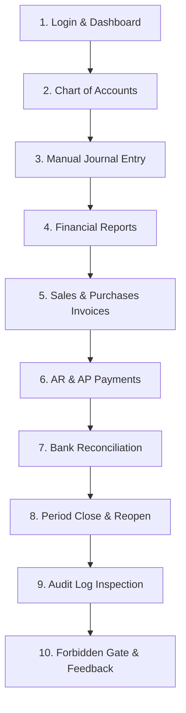

# Phase 16A-B-4: Partner Trial Notes and Operator Runbook

> Status: **Operational & Partner Trial Guide**. This document prepares the Financial ERP MVP for controlled partner trials. It establishes trial scope, operator setup procedures, testing scripts, known boundaries, and feedback collection workflows. Zero backend code, frontend code, database schema models, migrations, tests, RBAC seed catalogs, deployment files, or README edits belong to this phase.

---

## 1. Purpose

This document provides a comprehensive operator runbook and evaluation guide for conducting controlled external partner trials of the **Financial ERP Minimum Viable Product (MVP)**.

Key objectives:
- Guide business evaluators, certified accountants, and system administrators through structured end-to-end trial workflows.
- Clearly communicate current MVP capabilities and functional boundaries.
- Ensure that trials are conducted safely in isolated sandbox environments using synthetic test data.
- Standardize feedback collection, defect severity classification, and post-trial triage.

> [!NOTE]
> **Not a Production Certification Document**: This runbook is strictly intended for partner evaluation and usability validation of the Financial ERP core. It does not certify the system for live production deployments, regulatory tax authority filing, or unmonitored multi-tenant SaaS hosting. Zero new product features or code changes are introduced in this phase.

---

## 2. Trial Audience

This guide is tailored for the following primary evaluation roles:

| Evaluator Persona | Focus Area | Evaluation Objectives |
|---|---|---|
| **Business Owner / General Manager** | Executive oversight & operational viability | Evaluate commercial invoice settlement, dashboard clarity, financial summaries, and workflow ergonomics. |
| **Chief Accountant / Controller** | Financial integrity & compliance | Validate Chart of Accounts hierarchy, double-entry manual journal posting, financial statements (Trial Balance, Income Statement, Balance Sheet), and Period Close locking. |
| **Auditor / Financial Reviewer** | Transparency & auditability | Inspect the immutable Audit Log viewer, verify sensitive credential redaction, inspect before/after change diffs, and test read-only security gates. |
| **System Administrator** | Identity, access control, & governance | Manage user creation, role and permission assignments, session lifecycle, and evaluate access-denied boundaries. |
| **Partner Evaluator / ERP Consultant** | Functional depth & partner fit | Benchmark the ERP core against regional accounting standards and evaluate suitability for local partner rollouts. |

---

## 3. MVP Trial Scope

Partners are invited to evaluate the following 10 functional domains within the Financial ERP MVP:

1. **Authentication & Multi-Tenant Access Control (RBAC)**:
   - Secure login, in-memory token handling, HttpOnly session refresh, and tenant isolation by `companyId`.
   - Granular permission enforcement across UI navigation, action buttons, and backend APIs.
2. **Dashboard & Primary Hub**:
   - Company context display, active user profile details, real-time backend health check (`/api/health`), and dynamic module routing.
3. **Chart of Accounts (COA)**:
   - Account tree structure across 5 standard categories (`ASSET`, `LIABILITY`, `EQUITY`, `REVENUE`, `EXPENSE`).
   - Normal balance enforcement (`DEBIT` vs. `CREDIT`) and deletion safeguards for accounts with posted journal lines.
4. **Manual Journal Entries**:
   - Multi-line balanced journal drafting, real-time debit/credit equality check, posting transitions (`DRAFT` &rarr; `POSTED`), and draft cancellation.
5. **Real-Time Financial Statements**:
   - Read-only generation of Trial Balance (ميزان المراجعة), Income Statement (قائمة الدخل), and Balance Sheet (الميزانية العمومية).
   - Strict string-based decimal precision without floating-point rounding.
6. **Commercial Sales Invoicing**:
   - Customer invoicing, line-item pricing, 15% VAT calculation, invoice issuance (`DRAFT` &rarr; `ISSUED`), and automated General Ledger posting.
7. **Commercial Purchase Invoicing**:
   - Supplier invoicing, line-item costs, 15% VAT calculation, invoice receipt (`DRAFT` &rarr; `RECEIVED`), and automated General Ledger posting.
8. **Accounts Receivable (AR) & Accounts Payable (AP) Settlements**:
   - Customer payment receipt and supplier payment disbursement.
   - Invoice remaining balance recalculation, strict overpayment prevention (`409 Conflict`), and automated settlement GL postings.
9. **Bank Statement Reconciliation**:
   - Bank account setup (IBAN, book/bank balances), CSV statement ingestion, SHA-256 duplicate statement prevention, automated suggestion engine (EXACT / SUGGESTED), and manual match/unmatch workflows.
10. **Period Close & Fiscal Closing Guardrails**:
    - Pre-close validation (unposted drafts, unbalanced entries), monthly period close locking, server-side posting guard (`assertPeriodIsOpen`), reopen with mandatory justification, and fiscal year closing.
11. **Centralized Audit Trail Viewer**:
    - Centralized audit viewer at `/admin/audit-logs`, multi-parameter filtering, before/after JSON diffs, entity timeline inspection, sensitive data masking, and export preview estimation.

---

## 4. Out-of-Scope for Partner Trial

To set accurate expectations, the following domains are strictly **excluded** from the MVP trial:

> [!WARNING]
> **Explicit Non-Scope Areas**:
> - **Inventory & Stock Ledger**: Multi-warehouse stock tracking, FIFO / weighted-average valuation, stock movements, and inventory GL cost-of-goods-sold adjustments are deferred.
> - **Payroll & Human Resources**: Employee directory, salary computation, GOSI contributions, end-of-service benefits, and WPS compliance files.
> - **Manufacturing & Assembly**: Bill of Materials (BOM), production work orders, and job costing.
> - **Fixed Assets**: Asset register, depreciation schedules, and asset disposal accounting.
> - **Budgeting & Cost Centers**: Budget vs. actual variance analysis and departmental allocations.
> - **Multi-Currency**: Foreign exchange rate management, realized/unrealized FX gain/loss revaluation.
> - **Automated Bank Feeds**: Open Banking direct aggregator connections (reconciliation relies on user-uploaded standard CSV files).
> - **Real Binary File Exports**: Automated streaming or generation of downloadable PDF, Excel, or CSV report files (on-screen display and export preview count estimation provided).
> - **Mobile Phone Native Experience**: Responsive layouts are desktop- and tablet-optimized; native mobile apps (iOS/Android) are not included.
> - **ZATCA Phase 2 E-Invoicing**: Cryptographic stamp generation, QR code CSID signing, and direct clearance portal integration.
> - **Production Cloud Deployment & Security Certification**: Production hardening, load testing, and enterprise SOC2/ISO audits.

---

## 5. Suggested Demo Environment Setup

Operators preparing an evaluation sandbox for partners should follow this setup process:

1. **Host on an Isolated Sandbox**:
   - Deploy backend and frontend on a staging server or local demonstration workstation.
   - Do not connect trial instances to production financial databases or live company tenants.
2. **Use Synthetic Demo Data Only**:
   - Pre-populate a demo organization (e.g., `Al-Majd Trading Co. / شركة المجد للتجارة`).
   - Use mock customer names, synthetic supplier profiles, sample product codes, and fictitious bank IBANs (e.g., `SA0000000000000000000000`).
   - **Never import live corporate accounting ledgers or personal identifiable information (PII).**
3. **Pre-Seeded Demo Accounts**:
   - Verify that standard Chart of Accounts mapping is loaded (Cash, Bank, AR, AP, Sales Revenue, Purchases Expense, VAT Input, VAT Output).
4. **Role Provisioning**:
   - Prepare distinct user accounts for testing:
     - `admin@demo.local` (Administrator)
     - `accountant@demo.local` (Chief Accountant)
     - `auditor@demo.local` (Read-Only Auditor / Viewer)
     - `cashier@demo.local` (Commercial / POS Operator)
5. **Environment Health Verification**:
   - Run database migrations (`prisma:migrate:deploy`), generate the Prisma client (`prisma:generate`), and compile both backend and frontend before handing access to partners.

---

## 6. Suggested Roles and Permissions

The system enforces granular Role-Based Access Control. Operators should configure trial user accounts according to the following permission profiles (using existing seeded permission keys):

| Trial Role | Operational Purpose | Primary Permissions Assigned | Access Characteristics |
|---|---|---|---|
| **Admin** | Full system governance & setup | All seeded permissions (`users.*`, `accounting.*`, `sales.*`, `purchases.*`, `reconciliation.*`, `period_close.*`, `audit_log.*`) | Unrestricted access across all workspaces, actions, and settings. |
| **Accountant** | General ledger, reporting, & reconciliation | `accounting.read`, `accounting.accounts.*`, `accounting.journal.*`, `gl_accounts.read`, `gl_journal.read`, `reports.read`, `reconciliation.read`, `reconciliation.write`, `reconciliation.import`, `period_close.read`, `period_close.close`, `period_close.reopen`, `audit_log.read` | Full accounting control; cannot alter system user credentials or assign roles. |
| **Auditor / Viewer** | Compliance inspection & read-only audit | `gl_accounts.read`, `gl_journal.read`, `reports.read`, `audit_log.read`, `audit_log.export`, `reconciliation.read`, `period_close.read` | Strictly read-only; all creation, editing, posting, closing, and matching buttons are hidden or disabled. |
| **Sales User** | Commercial invoicing & customer payments | `sales.read`, `sales.create`, `sales.update`, `sales.delete`, `sales.issue`, `sales.cancel`, `ar_payments.read`, `ar_payments.write` | Limited to `/sales`; cannot access `/accounting`, period close, or audit logs. |
| **Purchases User** | Commercial supplier bills & payments | `purchases.read`, `purchases.create`, `purchases.update`, `purchases.delete`, `purchases.receive`, `purchases.cancel`, `ap_payments.read`, `ap_payments.write` | Limited to `/purchases`; cannot access `/accounting`, period close, or audit logs. |
| **Reconciliation Specialist**| Bank operations & statement matching | `reconciliation.read`, `reconciliation.write`, `reconciliation.import`, `gl_journal.read` | Focuses on `/accounting/reconciliation`; cannot close accounting periods. |

---

## 7. 30-Minute Partner Trial Script

Follow this step-by-step walkthrough to evaluate the entire Financial ERP MVP within 30 minutes:



### Step 1: Login & Session Bootstrap (2 mins)
1. Open the application URL (e.g., `http://localhost:3000/login`).
2. Log in using `admin@demo.local`.
3. Confirm clean redirection to `/dashboard`.
4. Inspect user card (name, email, company ID, active permissions) and live backend status card.

### Step 2: Review Chart of Accounts (3 mins)
1. Navigate to **المحاسبة** (`/accounting`).
2. Review the account tree on the left panel (Asset, Liability, Equity, Revenue, Expense).
3. Click **حساب جديد** (New Account), enter code `1103`, name `Petty Cash - Khobar / صندوق النثرية - الخبر`, select `ASSET`.
4. Confirm normal balance defaults to `DEBIT (مدين)` automatically.
5. Save account; verify it immediately appears in the active accounts list.

### Step 3: Create and Post Manual Journal Entry (3 mins)
1. In `/accounting`, locate the **القيود اليومية اليدوية** (Manual Journals) section on the right.
2. Click **قيد جديد** (New Entry).
3. Enter description: `Monthly office supplies expense / مصروفات أدوات مكتبية`.
4. Add Line 1: Select `5101 - General Expenses`, enter Debit `500.00`, Credit `0.00`.
5. Add Line 2: Select `1101 - Bank Account`, enter Debit `0.00`, Credit `500.00`.
6. Verify live balance indicator displays `متوازن (Balanced)`.
7. Click **حفظ كمسودة** (Save Draft).
8. In the journal entries list, click **ترحيل** (Post). Confirm status flips to `POSTED (مرحل)` with a timestamp.

### Step 4: Inspect Financial Reports (3 mins)
1. Click **التقارير المالية** in the header or navigate to `/accounting/reports`.
2. Select the **ميزان المراجعة** (Trial Balance) tab:
   - Confirm total debits equal total credits.
3. Select the **قائمة الدخل** (Income Statement) tab:
   - Verify that the posted expense appears under operating expenses and net income reflects the debit.
4. Select the **الميزانية العمومية** (Balance Sheet) tab:
   - Verify Total Assets equal Total Liabilities plus Total Equity.

### Step 5: Commercial Invoicing (Sales & Purchases) (4 mins)
1. Navigate to `/sales`:
   - Click **فاتورة مبيعات جديدة** (New Sales Invoice).
   - Select a customer, add a service line item for `1,000.00 SAR`, and verify 15% VAT (`150.00 SAR`) total `1,150.00 SAR`.
   - Click **إصدار الفاتورة** (Issue Invoice). Confirm status becomes `ISSUED`.
2. Navigate to `/purchases`:
   - Click **فاتورة مشتريات جديدة** (New Purchase Invoice).
   - Select a supplier, add a service line item for `400.00 SAR` + 15% VAT (`60.00 SAR`) total `460.00 SAR`.
   - Click **استلام الفاتورة** (Receive Invoice). Confirm status becomes `RECEIVED`.
3. Return to `/accounting/reports`:
   - Confirm automated GL entries for the sales and purchase invoices are reflected in Revenue, AR, AP, and VAT accounts.

### Step 6: Settle Customer & Supplier Payments (3 mins)
1. In `/sales`, open the issued invoice and click **تسجيل دفعة** (Record Payment).
   - Record an AR Payment of `1,150.00 SAR` via `BANK_TRANSFER`.
   - Confirm invoice status updates to fully paid and remaining balance becomes `0.00`.
2. In `/purchases`, open the received invoice and click **تسجيل سداد** (Record Payment).
   - Record an AP Payment of `460.00 SAR` via `BANK_TRANSFER`.
   - Confirm remaining balance becomes `0.00`.

### Step 7: Bank Statement Reconciliation (4 mins)
1. Navigate to `/accounting/reconciliation`.
2. Select the primary bank account from the dropdown.
3. In the **استيراد كشف حساب** (Import Statement) panel, upload a sample CSV statement containing the bank transfer matching the payment.
4. Verify import statistics (transactions added, statement hash computed).
5. Attempt to re-upload the same CSV file; verify immediate duplicate statement rejection (`409 Conflict`).
6. In the **محرك الاقتراحات** (Suggestions Engine) panel, review the suggested match pair.
7. Click **مطابقة** (Match). Confirm the transactions move from unmatched to matched status.

### Step 8: Period Close & Posting Guardrails (4 mins)
1. Navigate to `/accounting/period-close`.
2. Select the active monthly accounting period.
3. Click **التحقق من الفترة** (Validate Period); review pre-close integrity checks (all green).
4. Click **إقفال الفترة** (Close Period). Confirm status flips to `CLOSED (مقفل)`.
5. **Test Posting Guard**: Navigate back to `/accounting`, attempt to post a backdated manual journal dated inside the closed period.
   - Verify the server blocks posting with a clear `409 Conflict` ("الفترة المحاسبية مقفلة").
6. Return to `/accounting/period-close`, click **إعادة فتح الفترة** (Reopen Period), provide a justification note (`"Reopened for partner demonstration trial audit"`), and confirm status becomes `REOPENED`.

### Step 9: Centralized Audit Trail Inspection (3 mins)
1. Navigate to `/admin/audit-logs`.
2. Review the chronological activity stream.
3. Filter by Category: `ACCOUNTING`, Event: `JOURNAL_ENTRY_POSTED`.
4. Click **تفاصيل** (Details) on the journal posting event:
   - Inspect actor metadata, IP address, user-agent, and before/after state diffs.
5. Click **معاينة التصدير** (Export Preview):
   - Confirm record count estimation displays cleanly without downloading physical files.

### Step 10: Unauthorized Boundary Check & Feedback Submission (2 mins)
1. Log out of `admin@demo.local`.
2. Log in as `cashier@demo.local` (or a restricted role).
3. Try navigating directly to `/admin/audit-logs` or `/accounting/period-close`.
4. Verify the polite Arabic **تم رفض الوصول (Access Denied)** card renders with a safe return link to `/dashboard`.
5. Complete the partner trial feedback template.

---

## 8. Acceptance Criteria for MVP Trial

Partners and evaluators should consider the Financial ERP MVP **acceptable and successful** if all the following conditions are met:

- [x] **Core Accounting Completeness**: Can successfully execute chart of accounts configuration, manual journal entries, and financial statements without errors.
- [x] **Mathematical Integrity**: Trial Balance debit/credit sums always balance; Balance Sheet equation (`Assets = Liabilities + Equity`) holds strictly true.
- [x] **Consistent Invariants**: No floating-point rounding errors appear in monetary displays; all amounts match backend decimal calculations.
- [x] **Posting Guard Enforcement**: Closed periods strictly prevent backdated journal entries, invoice postings, and payment settlements.
- [x] **Reconciliation Decoupling**: Bank reconciliation functions cleanly without corrupting General Ledger balances or mutating `Payment.status`.
- [x] **Audit Trail Immutability**: All critical commercial and accounting actions are captured in `/admin/audit-logs` with sensitive credentials redacted.
- [x] **Permission Boundaries**: Missing permissions result in hidden actions or graceful access-denied cards without UI crashes or blank screens.
- [x] **No Blocking UI Crashes**: Core workflows execute cleanly with zero unhandled exceptions or console errors.
- [x] **Scope Alignment**: Evaluators understand and accept the defined boundaries (no inventory stock ledger, no payroll, no direct file downloads) for this initial release.

---

## 9. Known Limitations

The following limitations are inherent to the MVP architecture and must be taken into account during evaluation:

1. **Absence of Physical Stock Valuation**:
   - Product items are supported on invoices, but there is no running inventory stock ledger, warehouse bin tracking, or automated cost-of-goods-sold (COGS) journal generation upon sale.
2. **Exclusion of Payroll & HR**:
   - Employee salaries, deductions, leave tracking, and GOSI compliance files are excluded.
3. **No Direct Binary File Downloads**:
   - The UI does not stream or download PDF/Excel/CSV files for financial statements or audit logs. Evaluators use on-screen tables, filters, and export preview record counts.
4. **Manual CSV Bank Ingestion**:
   - Bank statement ingestion relies exclusively on standard CSV uploads. Direct bank API connections via Open Banking aggregators are not implemented.
5. **Manual Retained Earnings Treatment**:
   - Fiscal year close marks the fiscal year as `CLOSED` and locks transactions, but does not automatically post closing journal entries to Retained Earnings (deferred for manual review by the company accountant).
6. **Desktop / Tablet Optimization**:
   - Complex accounting tables, split reconciliation grids, and journal entry forms are optimized for desktop and tablet screens; mobile phone viewports are not officially supported.
7. **Synthetic Evaluation Context**:
   - The system is configured for demonstration and trial evaluations; it has not undergone third-party penetration testing or regulatory tax authority (ZATCA Phase 2) certification.

---

## 10. Data Handling and Privacy Notes

Operators and trial partners must adhere to strict data hygiene rules:

- **Strictly Synthetic Data**: Use only fictional business entities, simulated customer and supplier names, and fake bank account numbers.
- **No Real Bank Statements**: Do not upload actual corporate or personal bank statements containing genuine customer account numbers or real financial transactions.
- **Credential Protection**: The centralized audit trail automatically redacts passwords, tokens, API keys, IBANs, and secret fields. Do not attempt to reverse or bypass masking.
- **No Client-Side Token Storage**: Access tokens are kept in volatile memory only; refresh cookies are HttpOnly. Closing the browser tab tears down local session state.
- **Sanitized Feedback**: When submitting feedback, screenshots, or logs, ensure that test passwords, internal IP addresses, and private server tokens are omitted.

---

## 11. Feedback Collection Template

Evaluators should record all observations, discrepancies, and enhancement requests using the following standardized template:

```markdown
### Partner Trial Feedback Form

- **Partner / Organization Name**: [e.g., Al-Nokhba Accounting Advisory]
- **Tester Name & Role**: [e.g., Senior Auditor]
- **Evaluation Date**: [YYYY-MM-DD]
- **Environment Tested**: [e.g., Local Sandbox / Staging Server]
- **Workflow Evaluated**: [e.g., Manual Journal Entry / Bank Reconciliation / Period Close]
- **Outcome**: [ ] PASS   [ ] PASS WITH NOTES   [ ] BLOCKED

#### Observation / Issue Description
[Provide a clear, step-by-step description of what was tested and what occurred.]

#### Expected Behavior
[Describe what you expected to occur according to accounting principles or ERP standards.]

#### Severity Classification
- [ ] **P0 - Blocker**: System crash, data corruption, broken double-entry balance, or security bypass.
- [ ] **P1 - Critical**: Core accounting workflow cannot be completed; no workaround available.
- [ ] **P2 - Important**: Workflow completed, but error message is confusing or UX is suboptimal.
- [ ] **P3 - Minor / Enhancement**: Aesthetic suggestion, minor localization polish, or feature request.

#### Business Impact
[Briefly describe how this affects daily accounting or business operations.]

#### Must-Have Before Wider Launch?
- [ ] Yes (Blocks adoption)
- [ ] No (Acceptable for initial pilot)

#### Attachments / References
[Attach screenshots, sample CSV, or console log snippets if applicable.]
```

---

## 12. Support and Escalation

Operators running partner trials should establish an escalation pathway:

### Triage Process:
1. **Receipt**: All feedback forms are logged in the trial tracking repository.
2. **Classification**:
   - **P0 (Blocker)**: Immediate triage within 4 hours. Halts active evaluation until resolved or worked around.
   - **P1 (Critical)**: Investigated within 24 hours. Evaluated for inclusion in immediate stabilization patches.
   - **P2 / P3 (Important / Nice-to-Have)**: Documented in the product roadmap backlog for post-trial prioritization.
3. **Escalation Contacts**:
   - Technical & Engineering Lead: Core platform, database, and backend APIs.
   - Financial Product Owner: Accounting rules, statement accuracy, and reconciliation logic.

---

## 13. Pre-Trial Operator Checklist

Before handing the environment over to trial evaluators, operators must execute and verify every step below:

- [ ] **Repository Baseline**: Git branch is `main` with a clean working tree (`git status --short -uall` empty).
- [ ] **Prisma Synchronization**: Run `pnpm --filter @erp/backend prisma:generate`.
- [ ] **Database Migrations**: Run `pnpm --filter @erp/backend prisma:migrate:deploy` (14 migrations verified, 0 pending).
- [ ] **Backend Compilation**: Run `pnpm --filter @erp/backend build` (NestJS compiles with 0 errors).
- [ ] **Automated Regression Suite**: Run `pnpm --filter @erp/backend test:e2e` (**216/216 passing tests**).
- [ ] **Frontend Compilation**: Run `pnpm --filter @erp/frontend build` (Next.js compiles 20 static pages cleanly).
- [ ] **Demo Tenant Seeded**: Demo company, Chart of Accounts, sample customers, and vendors initialized.
- [ ] **Role Accounts Configured**: Distinct user logins for Admin, Accountant, Auditor, and Cashier verified.
- [ ] **Data Hygiene Confirmed**: Zero live financial records, production customer PII, or real IBANs in the database.
- [ ] **Trial Pack Delivered**: Evaluators have received this runbook, evaluation credentials, and sample CSV statements.

---

## 14. Post-Trial Review Checklist

Upon completion of the partner evaluation period:

- [ ] **Collect Feedback**: Aggregate all submitted feedback forms and observation logs.
- [ ] **Categorize Defect Reports**: Separate true bugs from out-of-scope feature requests (e.g., inventory stock tracking).
- [ ] **Evaluate Acceptance Criteria**: Assess whether all 9 acceptance criteria were satisfied across evaluator sessions.
- [ ] **Go / No-Go Decision**:
  - Determine if the Financial ERP MVP is approved for broader customer pilots.
  - Determine whether Phase 17 should commence with Inventory & Warehouse Stock Ledger development.
- [ ] **Security & Production Hardening Audit**: Outline cloud deployment, Docker production configs, and backup schedules for live deployments.

---

## 15. Verification Expectations

The codebase must strictly satisfy all automated build and test expectations:

```bash
# Prisma Client Generation
pnpm --filter @erp/backend prisma:generate

# Migration Health Check
pnpm --filter @erp/backend prisma:migrate:deploy

# Backend Strict Compilation
pnpm --filter @erp/backend build

# Automated E2E Regression Baseline
pnpm --filter @erp/backend test:e2e

# Frontend Production Build
pnpm --filter @erp/frontend build
```

**Expected Baseline**:
- Prisma Generate: PASS (0 drift)
- Database Migrations: PASS (14 applied, 0 pending)
- Backend Build: PASS (0 TypeScript errors)
- Backend E2E: PASS (**216 passed, 216 total**)
- Frontend Build: PASS (20 static pages compiled)

---

## 16. Boundary Confirmations

- [x] **No backend changes**: Zero modifications to NestJS services, controllers, or modules.
- [x] **No frontend changes**: Zero modifications to Next.js pages, components, or client libraries.
- [x] **No Prisma schema changes**: `schema.prisma` was not altered.
- [x] **No migrations created**: Migration ledger remains at 14 migrations.
- [x] **No README changes**: `README.md` was not modified in this phase.
- [x] **No test changes**: Automated test files untouched.
- [x] **No RBAC seed changes**: Permission catalogs and roles untouched.
- [x] **No package or deployment changes**: `package.json`, lockfiles, and Docker configs untouched.
- [x] **No new feature domains**: Zero additions in Inventory, Payroll, HR, Manufacturing, Fixed Assets, or Budgeting.

---

## 17. Recommended Next Step

Proceed to **Phase 16A-C-1 – Final Full Verification**:
- Execute complete, pristine validation pass (`prisma:generate`, `prisma:migrate:deploy`, `build`, `test:e2e`).
- Verify clean working tree and confirm 216/216 passing test baseline before updating `README.md`.
