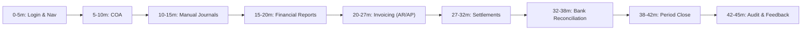
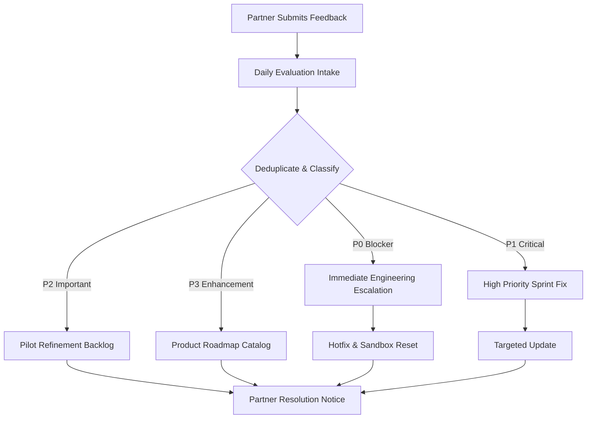

# Phase 17A-B-3: Trial Access Pack and Feedback Form

> Status: **Operational Template & Partner Pack Document**. The Financial ERP MVP milestone is formally closed (Phase 16A). This document establishes the partner-facing trial access pack, invitation message templates, structured 45-minute evaluation script, standardized feedback collection template, severity triage framework, and escalation channels. Zero backend code, frontend code, database schema models, migrations, automated tests, RBAC seed catalogs, deployment automation files, or README files are modified as part of this deliverable.

---

## 1. Purpose

The purpose of this document is to provide evaluation coordinators, operators, and customer-success leads with an end-to-end, partner-facing access package and feedback collection toolkit for the Financial ERP MVP controlled trial.

### Operational Boundaries & Scope Clarification:
- **Partner Pack Template Only**: This document serves as a standardized communication and evaluation guide. Placeholders (such as URLs, contact emails, and invitation links) must be filled outside Git before sharing with external partners.
- **Zero Real Data or Credentials**: No real credentials, plaintext passwords, private production URLs, API keys, or confidential partner data are stored in this repository.
- **No Product Changes**: No UI components, backend endpoints, database schema models, or permission seed lists are created or modified.

---

## 2. How to Use This Pack

Operators and trial coordinators must follow this operational checklist when preparing communications for prospective partner cohorts:

1. **Copy Template to Private Communication Channel**: Copy the invitation and access templates into a secure external document or private enterprise email client (outside Git).
2. **Replace All Placeholders Outside Git**: Replace all uppercase bracketed tokens (e.g., `<PARTNER_NAME>`, `<SANDBOX_FRONTEND_URL>`) with cohort-specific values.
3. **Use Sandbox-Only URLs Exclusively**: Ensure the link provided points to the isolated sandbox domain (`<SANDBOX_FRONTEND_URL>`), never to development servers or production environments.
4. **Invite Approved Partner Testers Only**: Limit invitations strictly to the designated evaluation participants who have signed trial agreements.
5. **Enforce Secure Invitation / Password Delivery**: Never send credentials or passwords in unencrypted bulk emails. Direct participants to use the one-time invitation/activation link or secure credential exchange process.
6. **Attach Known Limitations Summary**: Ensure Section 7 ("Known Limitations to Share") is explicitly communicated to manage scope expectations.
7. **Specify Concrete Feedback Deadlines & Support Window**: State exact calendar start and end dates along with designated support hours.

---

## 3. Partner Trial Invitation Template

*Copy and adapt the following template for initial partner outreach:*

```text
Subject: Invitation: Controlled Partner Trial – Financial ERP MVP Sandbox

Dear <PARTNER_NAME> Team,

We are delighted to invite you to participate in the controlled partner trial of our Financial ERP Minimum Viable Product (MVP). 

1. Purpose of the Trial:
The objective of this trial is to gather your professional feedback on core accounting, financial reporting, commercial billing, bank statement reconciliation, period close, and audit trail workflows. Your insights will directly shape subsequent release milestones.

2. Trial Evaluation Window:
- Start Date: <TRIAL_START_DATE>
- End Date: <TRIAL_END_DATE>
- Expected Time Commitment: Approximately 45 minutes for the guided evaluation script.

3. Sandbox Environment Access:
- Sandbox URL: <SANDBOX_FRONTEND_URL>
- Environment Type: Dedicated, isolated evaluation sandbox populated with synthetic demo data.
- Initial Login Instructions: Please follow the secure invitation link sent individually to each participant to initialize your trial session.

4. What to Test (In-Scope):
- Chart of Accounts navigation and normal balance indicators.
- Manual journal entries (balancing enforcement, draft saving, posting).
- Financial statements (Trial Balance, Income Statement, Balance Sheet with decimal accuracy).
- Commercial sales and purchase invoicing with 15% VAT calculation.
- AR customer receipts and AP vendor disbursements with overpayment protection.
- Bank statement CSV ingestion, duplicate detection, auto-suggestions, and manual match/unmatch.
- Monthly period closing, closed-period posting rejection, and authorized period reopening.
- Centralized audit trail filtering and before/after difference inspection.

5. What NOT to Test (Explicitly Out-of-Scope for this MVP):
- ❌ Inventory stock levels, warehouse transfers, or stock ledger valuation.
- ❌ Payroll, employee directory, and WPS wage files.
- ❌ Fixed assets and automated depreciation schedules.
- ❌ Live external bank feeds (use the provided synthetic CSV statement instead).
- ❌ Physical PDF or Excel binary export generation.

6. Critical Data Privacy Warning:
This sandbox is an isolated testing system. Under no circumstances should real company financial records, real customer/vendor identities, real bank statements, or real IBANs be entered or uploaded. All testing must use the synthetic demonstration data provided.

7. Feedback Submission & Support:
Please capture any observations, usability feedback, or unexpected behaviors using our standardized form:
Feedback Form: <FEEDBACK_FORM_URL>
Feedback Deadline: <TRIAL_END_DATE>

If you encounter any access difficulties or have questions, our engineering support team is available at <SUPPORT_CONTACT>.

Thank you for your valuable partnership.

Warm regards,

Financial ERP Engineering & Product Team
```

---

## 4. Access Information Template

Distribute the following persona access mapping to partner evaluators so each participant can test the system according to their organizational specialization:

| Persona | Invitation / Login Placeholder | Purpose in Trial | Main Areas to Test | Key Restrictions & Boundaries |
| :--- | :--- | :--- | :--- | :--- |
| **Trial Admin** | `<TRIAL_ADMIN_INVITE>` | Overall system overseer & evaluation coordinator | Full dashboard, company setup review, audit trail viewer, period close controls. | Coordinates cohort sessions; must not disable audit logging. |
| **Accountant** | `<ACCOUNTANT_EMAIL>`<br>`<ACCOUNTANT_INVITE>` | Primary certified accountant / financial controller | Chart of Accounts, manual journal entries, Trial Balance, Income Statement, Balance Sheet, period close/reopen. | Standard accounting evaluation; restricted from administrative audit trail unless granted. |
| **Auditor / Viewer** | `<AUDITOR_EMAIL>`<br>`<AUDITOR_INVITE>` | Compliance officer / statutory auditor | Read-only ledger inspection, financial statement verification, audit trail change logs, export preview. | **Strictly zero write actions**. "Create", "Post", and "Close" buttons hidden or forbidden. |
| **Sales User** | `<SALES_EMAIL>`<br>`<SALES_INVITE>` | Accounts Receivable / Billing specialist | Sales invoice drafting, 15% VAT calculation, issuing invoices, recording customer receipts. | No access to purchase invoices, manual journals, period close, or audit logs. |
| **Purchases User** | `<PURCHASES_EMAIL>`<br>`<PURCHASES_INVITE>` | Accounts Payable / Procurement specialist | Purchase bill drafting, receiving bills, recording supplier disbursements. | No access to sales invoices, manual journals, period close, or audit logs. |
| **Reconciliation User** | `<RECONCILIATION_EMAIL>`<br>`<RECONCILIATION_INVITE>` | Treasury & Cash Management specialist | Bank statement CSV upload, duplicate upload rejection, suggestion review, match/unmatch. | Restricted from closing accounting periods or creating GL accounts. |
| **Executive Viewer** | `<EXECUTIVE_EMAIL>`<br>`<EXECUTIVE_INVITE>` | Managing Director / Executive | High-level financial reporting dashboard, Trial Balance, P&L, Balance Sheet. | Strictly read-only reporting; operational billing and journal screens hidden. |

---

## 5. 45-Minute Guided Trial Script

This step-by-step agenda guides evaluators through the entire Financial ERP MVP within approximately 45 minutes:



### Script Agenda:

#### Block 1: Login, Dashboard & Navigation (0–5 min)
- **Task**: Navigate to `<SANDBOX_FRONTEND_URL>`, log in as `Accountant` (`<ACCOUNTANT_EMAIL>`). Observe dashboard cards and health status badge.
- **Expected Result**: Dashboard renders cleanly without console errors. System health displays `ONLINE` (`/api/health` HTTP 200). Navigation sidebar shows accessible modules.
- **Notes to Capture**: Navigation intuitiveness, layout responsiveness, clarity of system health indicator.

#### Block 2: Chart of Accounts & Structural Setup (5–10 min)
- **Task**: Navigate to `/accounting/accounts`. Inspect 5 standard account classes (Assets, Liabilities, Equity, Revenue, Expenses). Verify normal balance indicators (`DEBIT` vs. `CREDIT`).
- **Expected Result**: Hierarchical 4-digit accounts tree loads. Account `1101 - Primary Bank` shows `ASSET` (`DEBIT`). Deletion of accounts with active ledger entries is disabled.
- **Notes to Capture**: Account classification clarity, Arabic/English naming appropriateness.

#### Block 3: Manual Journal Entry Lifecycle (10–15 min)
- **Task**: Navigate to `/accounting/journal-entries`. Create a balanced journal entry (e.g., Dr 5201 Bank Fees 150.00 SAR, Cr 1101 Primary Bank 150.00 SAR). Test saving as `DRAFT`, then click `POST`. Next, attempt an unbalanced entry (Dr 500.00, Cr 400.00).
- **Expected Result**: Balanced draft posts cleanly, transitioning to `POSTED`. Unbalanced entry is rejected with clear visual validation message.
- **Notes to Capture**: Debits/credits entry ergonomics, clarity of balancing error messages.

#### Block 4: Financial Statements & Mathematical Accuracy (15–20 min)
- **Task**: Navigate to `/reports`. Run Trial Balance, Income Statement, and Balance Sheet for September 2026. Verify totals.
- **Expected Result**: Trial Balance debits equal credits. Income Statement shows Net Income. Balance Sheet confirms `Assets = Liabilities + Equity`. Decimal figures display clean string-based rounding.
- **Notes to Capture**: Readability of statement formatting, financial terminology consistency.

#### Block 5: Commercial Invoicing — Sales & Purchases (20–27 min)
- **Task**: 
  1. Navigate to `/sales/invoices`. Create a draft sales invoice with 15% VAT; issue the invoice (`ISSUED`).
  2. Navigate to `/purchases/invoices`. Create a draft purchase invoice with 15% VAT; receive the invoice (`RECEIVED`).
- **Expected Result**: Invoices calculate 15% VAT automatically. Issuing and receiving triggers automated GL posting entries.
- **Notes to Capture**: Speed of line-item entry, invoice layout clarity, tax breakdown transparency.

#### Block 6: AR / AP Payments & Settlement Tracking (27–32 min)
- **Task**: Navigate to `/payments`.
  1. Record a partial payment against the issued sales invoice.
  2. Record a full settlement against the received purchase bill.
  3. Attempt an overpayment exceeding the invoice balance.
- **Expected Result**: Invoice outstanding balances update dynamically. Overpayment attempt is rejected with HTTP `409 Conflict`.
- **Notes to Capture**: Settlement tracking clarity, overpayment error message usability.

#### Block 7: Bank Statement CSV Reconciliation (32–38 min)
- **Task**: Navigate to `/accounting/reconciliation`. Select `Operating Bank Account`.
  1. Upload synthetic CSV statement (`synthetic_bank_statement_2026_09.csv`).
  2. Attempt to re-upload the same CSV to test duplicate detection.
  3. Review auto-suggestions and execute one match.
  4. Perform a manual unmatch.
- **Expected Result**: CSV imports successfully. Duplicate upload is rejected with `409 Conflict`. Match suggestions display match score; unmatch decouples records safely.
- **Notes to Capture**: CSV parsing ease, suggestion engine confidence, match/unmatch clarity.

#### Block 8: Period Close & Fiscal Year Close (38–42 min)
- **Task**: Navigate to `/accounting/period-close`.
  1. Run the Pre-Close Validation on period `2026-09`.
  2. Close period `2026-09`.
  3. Attempt to post an invoice in closed period `2026-09`.
  4. Reopen period `2026-09` providing a mandatory text reason.
- **Expected Result**: Closed period rejects new postings with `409 Conflict`. Reopen prompts for mandatory justification text and restores `OPEN` status.
- **Notes to Capture**: Controller confidence in tamper-proof period locking, reopen audit trail clarity.

#### Block 9: Audit Trail Inspection & Feedback Submission (42–45 min)
- **Task**: Log in as `Trial Admin` (`<TRIAL_ADMIN_EMAIL>`). Navigate to `/admin/audit-logs`. Filter events by category (`RECONCILIATION`, `PERIOD_CLOSE`). Click an event to inspect before/after diffs and password redaction. Complete the feedback form.
- **Expected Result**: Audit entries display full history. Passwords and tokens are masked with `[REDACTED]`. Feedback submitted via `<FEEDBACK_FORM_URL>`.
- **Notes to Capture**: Audit transparency, ease of submitting feedback.

---

## 6. Detailed Trial Verification Checklist

Evaluators or operators can use this quick-reference checklist to confirm execution of all key trial milestones:

- [ ] **Authentication**: Login succeeds across assigned personas via `<SANDBOX_FRONTEND_URL>`.
- [ ] **Dashboard**: System health status renders `ONLINE` and role-permitted navigation cards are visible.
- [ ] **Chart of Accounts**: 5 classes displayed with correct normal balance flags.
- [ ] **Journal Posting**: Balanced journal entry posts successfully to the General Ledger.
- [ ] **Balancing Safeguard**: Unbalanced journal entry is blocked by client and server validation.
- [ ] **Financial Reports**: Trial Balance, Income Statement, and Balance Sheet render with balanced totals.
- [ ] **Sales Invoicing**: Sales invoice issued with automatic 15% VAT and GL posting.
- [ ] **Purchase Invoicing**: Purchase bill received with automatic 15% VAT and GL posting.
- [ ] **Customer Payment (AR)**: Payment posted against sales invoice; balance due updates.
- [ ] **Supplier Payment (AP)**: Payment posted against purchase bill; balance due updates.
- [ ] **Overpayment Guard**: Payment exceeding remaining balance is blocked with `409 Conflict`.
- [ ] **Statement Import**: Synthetic CSV bank statement imports without column mapping errors.
- [ ] **Duplicate File Guard**: Re-uploading the same statement file is rejected with `409 Conflict`.
- [ ] **Reconciliation Match / Unmatch**: Auto-suggestion match accepted and manual unmatch verified.
- [ ] **Period Close**: Active period validated and closed; postings inside closed period blocked (`409`).
- [ ] **Period Reopen**: Period reopened with mandatory justification captured.
- [ ] **Fiscal Year Close**: Year close validation enforces prior closure of all monthly periods.
- [ ] **Audit Trail**: Activity events visible in `/admin/audit-logs` with sensitive credentials redacted.
- [ ] **Role Boundaries**: Unauthorized actions and restricted views are blocked gracefully.
- [ ] **Feedback Submitted**: Partner evaluation response recorded via `<FEEDBACK_FORM_URL>`.

---

## 7. Known Limitations to Share with Partners

To prevent confusion and ensure evaluation focuses exclusively on the Financial ERP MVP, share this explicit limitations summary:

> [!NOTE]
> **Partner Scope Summary — Explicitly Out-of-Scope in this MVP**:
> 1. **No Inventory & Warehouse Stock Ledger**: Master product items can be invoiced, but physical stock balances, bin locations, and inventory FIFO/average valuation are not tracked.
> 2. **No Payroll & HR**: Employee directory, payroll calculations, GOSI contributions, and WPS bank salary files are not included.
> 3. **No Manufacturing & Job Costing**: Bill of Materials (BOM) and production assembly work orders are not part of this release.
> 4. **No Fixed Assets Ledger**: Asset registration and automatic monthly depreciation journals are not included.
> 5. **No Budgeting & Departmental Cost Centers**: Budget variance comparisons are not supported.
> 6. **No Multi-Currency Revaluation**: All transactions and reports operate strictly in Saudi Riyals (SAR).
> 7. **No Live Bank Feeds**: Statements are imported via standard CSV files; open banking API integration is deferred.
> 8. **No Binary File Exports**: Report and audit export buttons provide on-screen data previews and row estimations; physical PDF/Excel streaming is deferred.
> 9. **No Mobile Native App Guarantee**: The application is optimized for desktop browsers (Chrome, Edge, Firefox, Safari); native mobile wrappers are not included.
> 10. **Sandbox Only**: The trial environment is not certified for production workloads or official statutory accounting.

---

## 8. Data Privacy and Safety Rules

All participants must strictly adhere to these mandatory safety and privacy requirements:

1. **No Real Business Records**: Do not enter real customer names, vendor profiles, invoices, or accounting figures.
2. **No Real Bank Statements**: Do not upload actual bank statement CSV files, scanned statements, or bank account credentials.
3. **No Real Tax Identifiers or IBANs**: Use only the synthetic test numbers provided in the Demo Data Guide.
4. **No Credential Sharing**: Do not share trial credentials outside your authorized evaluation group.
5. **No Legal or Statutory Reliance**: Trial calculations, tax summaries, and financial reports are exploratory and cannot be used for ZATCA filings, tax returns, or statutory financial statements.
6. **Immediate Exposure Reporting**: If you suspect any sensitive data exposure or accidental real data upload, notify `<SUPPORT_CONTACT>` immediately for an environment reset.
7. **Sanitized Feedback**: Do not include passwords, session cookies, or proprietary corporate data in feedback submissions.

---

## 9. Feedback Form Template

*Standardized evaluation response template for partners:*

| Field Name | Description / Valid Options | Partner Response |
| :--- | :--- | :--- |
| **Partner Organization Name** | Name of the participating firm | `<PARTNER_NAME>` |
| **Evaluator Name** | Name of the primary tester | |
| **Evaluator Role / Title** | Certified Accountant / Controller / Auditor / Sales Specialist / IT | |
| **Evaluation Date** | Date test was performed (YYYY-MM-DD) | |
| **Client Browser & OS** | Chrome, Edge, Firefox, Safari on Windows / macOS / Linux | |
| **Workflow Tested** | COA / Journals / Reports / Invoicing / Payments / Reconciliation / Period Close / Audit Trail | |
| **Evaluation Result** | `PASS` (Flawless) \| `WARN` (Usable with minor issues) \| `FAIL` (Blocked) | |
| **Issue Severity (if applicable)** | `P0 Blocker` \| `P1 Critical` \| `P2 Important` \| `P3 Nice-to-Have` | |
| **Issue Classification** | `Bug` \| `Usability / UX` \| `Accounting Logic` \| `Reporting` \| `Permissions` \| `Performance` \| `Other` | |
| **Steps to Reproduce** | Numbered sequence of steps leading to the observed behavior | 1.<br>2.<br>3. |
| **Expected Behavior** | What the evaluator expected to occur according to accounting standards | |
| **Actual Behavior** | What actually occurred (include error text or visual discrepancy) | |
| **Evidence Link** | Secure link to screenshot, recording, or console text | |
| **Commercial / Business Impact** | High / Medium / Low operational impact on daily accounting operations | |
| **Suggested Improvement** | Partner recommendation on how to refine the feature or workflow | |
| **Required Before Broader Pilot?** | `YES (Mandatory Fix)` \| `NO (Can be addressed in future roadmap)` | |
| **General Impressions & Notes** | Qualitative feedback on system speed, clarity, and overall experience | |

---

## 10. Severity Definitions

When triaging partner feedback, apply these four standard severity categories:

- **P0 – Blocker**:
  - *Definition*: Prevents continuation of the evaluation or causes financial data corruption, unbalanced general ledger postings, or exposure of unredacted credentials.
  - *Action*: Immediate halt to trial cohort; hotfix and baseline reset required before proceeding.
- **P1 – Critical**:
  - *Definition*: A core advertised workflow cannot be completed (e.g., CSV statement fails to parse, 15% VAT calculates incorrectly, period close fails to lock postings), with no viable workaround.
  - *Action*: Prioritized fix required before concluding trial or onboarding additional partners.
- **P2 – Important**:
  - *Definition*: The workflow succeeds, but the user experience is confusing, terminology is ambiguous, or a workaround is required (e.g., unclear column header alias, non-intuitive button placement).
  - *Action*: Scheduled for refinement prior to broader pilot rollout.
- **P3 – Nice-to-Have / Enhancement**:
  - *Definition*: Minor cosmetic improvement, layout suggestion, or request for out-of-scope roadmap capabilities (e.g., inventory tracking, bulk Excel export, dark mode).
  - *Action*: Logged in product backlog for future roadmap planning.

---

## 11. Feedback Triage Workflow

All incoming partner feedback must follow this operational triage workflow:



1. **Daily Intake**: Review all feedback submissions at the close of each trial business day.
2. **Deduplication**: Match against existing issue logs to prevent redundant tracking.
3. **Severity Classification**: Assign P0, P1, P2, or P3 based on the severity matrix.
4. **Reproducibility Verification**: Replicate the exact reported sequence on a local staging instance.
5. **Defect vs. Scope Separation**: Distinguish between functional bugs and requests for out-of-scope modules (e.g., inventory).
6. **Decision Mapping**:
   - *Fix Blocker*: Emergency patch required.
   - *Refine for Pilot*: Address before broader customer pilot.
   - *Roadmap Candidate*: Defer to future development phases (e.g., Phase 18+).
7. **Partner Communication**: Send formal acknowledgement and resolution status back to the partner.

---

## 12. Support and Escalation Template

Provide partner evaluators with clear support contact details:

```text
=====================================================
FINANCIAL ERP MVP – PARTNER TRIAL SUPPORT DIRECTORY
=====================================================

Primary Support Channel:
- Dedicated Support Email: <SUPPORT_CONTACT>
- Operational Support Hours: <SUPPORT_HOURS> (e.g., Sun–Thu, 09:00–17:00 AST)

Emergency Escalation Contact:
- Escalation Lead: <ESCALATION_CONTACT>
- Use Emergency Escalation ONLY for P0 Blockers (e.g., total sandbox unavailability, data integrity defect).

What to Include in Your Support Request:
1. Assigned Persona / Email used during testing.
2. Exact URL and page where the issue occurred.
3. Specific transaction ID or invoice number involved.
4. Clear description of observed vs. expected behavior.
5. Screenshot or browser console error snippet (ensuring no private information is captured).

Target Response Times:
- P0 Blocker: Initial response within 1 hour during support hours.
- P1 Critical: Response within 4 hours.
- P2 Important: Response within 1 business day.
- P3 Inquiry / Suggestion: Logged and summarized in trial closure report.
=====================================================
```

---

## 13. Trial Closure Message Template

*Deliver this communication to partners at the conclusion of their evaluation window:*

```text
Subject: Thank You for Participating in the Financial ERP MVP Partner Trial

Dear <PARTNER_NAME> Team,

We would like to extend our sincere appreciation for your participation in the controlled evaluation of our Financial ERP Minimum Viable Product.

Your hands-on assessment of our Chart of Accounts, manual journal entries, commercial invoicing, AR/AP settlements, bank reconciliation, period close, and audit trail provides invaluable real-world guidance.

Next Steps:
1. Final Feedback Submission: If you have any outstanding evaluation notes or suggestions, please submit them via <FEEDBACK_FORM_URL> by <TRIAL_END_DATE>.
2. Feedback Synthesis: Our product and engineering teams will consolidate and triage all observations according to our formal severity matrix.
3. Findings Summary: We will share an executive summary of the trial results and our upcoming product roadmap decisions with your leadership team.

Sandbox Sunset:
Please note that access to the trial sandbox at <SANDBOX_FRONTEND_URL> will conclude on <TRIAL_END_DATE>. In accordance with our security policy, all trial user sessions will be decommissioned and the sandbox database will be reset.

Thank you once again for your professional collaboration and commitment to advancing our enterprise financial platform.

Warm regards,

Financial ERP Leadership Team
<SUPPORT_CONTACT>
```

---

## 14. Internal Launch Checklist

Before sharing this pack with any external partner, the trial coordinator must sign off on all internal prerequisites:

- [ ] **Sandbox URL Prepared**: `<SANDBOX_FRONTEND_URL>` verified active with valid HTTPS certificate.
- [ ] **Trial Users Invited**: Personas pre-configured with secure credentials ready for delivery.
- [ ] **Known Limitations Distributed**: Partner leadership has acknowledged the out-of-scope module list.
- [ ] **Feedback Form Active**: `<FEEDBACK_FORM_URL>` tested and accepting submissions.
- [ ] **Support Personnel Assigned**: Designated engineer and operator on duty during `<SUPPORT_HOURS>`.
- [ ] **Demo Data Baseline Active**: Synthetic demo company seeded and verified against the Demo Data Guide.
- [ ] **Pre-Launch Build Certified**: Backend E2E (216/216 passed) and frontend production build verified.
- [ ] **Zero Real Data Confirmed**: Database audited to verify 100% synthetic records.
- [ ] **Trial Schedule Confirmed**: Cohort dates (`<TRIAL_START_DATE>` to `<TRIAL_END_DATE>`) mutually agreed.

---

## 15. Post-Trial Decision Checklist

At the conclusion of the trial cohort, engineering and product leadership will review the findings against this decision matrix:

1. **P0 / P1 Blocker Status**: Are there zero open P0 or P1 defects reported by evaluators?
2. **Core Workflow Completion**: Did evaluators successfully complete the 45-minute guided script without unhandled errors?
3. **Permission Clarity**: Did evaluators find the role-based navigation and access denied boundaries clear and appropriate?
4. **Statement Trust**: Did professional accounting evaluators confirm confidence in Trial Balance, P&L, and Balance Sheet math?
5. **Reconciliation Usability**: Was the CSV statement matching and duplicate detection intuitive and effective?
6. **Period Close Integrity**: Was the tamper-proof nature of closed periods recognized as reliable for compliance?
7. **Audit Trail Utility**: Did evaluators confirm that the audit trail provides sufficient change tracing for internal controls?
8. **Next Milestone Decision**:
   - *Option A*: **Patch & Iterate** (Address critical feedback items before any broader release).
   - *Option B*: **Expand Pilot Cohort** (Onboard additional partner organizations to the verified sandbox).
   - *Option C*: **Advance Roadmap** (Begin formal design and implementation of next functional domain, such as Inventory Stock Ledger).

---

## 16. Recommended Next Step

Upon completion of this pack, proceed to:

**Phase 17A-C-1 – Launch Readiness Verification**:
- Execute a complete, pristine verification pass across the entire codebase.
- Confirm Prisma client generation, migration deployment (14/14 applied), backend NestJS build, full automated E2E regression suite (216/216 passing), and Next.js frontend production compilation.
- Verification-only sub-phase certifying launch readiness with zero source code changes.
