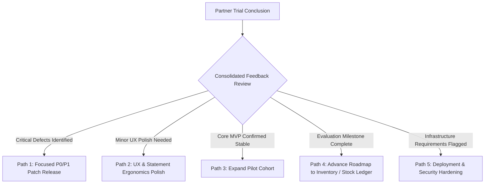

# Phase 17A-C-2: Trial Launch Closure Notes

> Status: **Milestone Closure Document**. Phase 17A (Partner Trial Launch Preparation) is formally completed and closed. The Financial ERP Minimum Viable Product (MVP) is officially certified ready for controlled external partner trials. Zero backend code, frontend code, database schema models, migrations, automated tests, RBAC seed catalogs, deployment automation scripts, or README files are modified as part of this deliverable.

---

## 1. Purpose

The purpose of this document is to formally close Phase 17A and certify that the Financial ERP MVP partner trial launch preparation is complete. All operational documentation, sandbox checklists, synthetic demo datasets, trial access packs, feedback mechanisms, and launch readiness verifications have been fully established and verified.

### Operational Boundaries & Scope Clarification:
- **Phase 17A Closure Only**: This note marks the successful conclusion of the partner trial preparation phase.
- **Controlled Partner Trials Ready**: The Financial ERP MVP is certified as operational and stable for controlled partner evaluations.
- **Not Production Certification**: This document does not certify production readiness, public SaaS availability, SOC2 compliance, or commercial high-concurrency scaling.
- **Zero Real Secrets or Credentials in Git**: All operational runbooks, invitation templates, and dataset specifications use abstract placeholders. Zero real passwords, private host URLs, API tokens, or real corporate financial data are committed to source control.

---

## 2. Phase 17A Deliverables Completed

Phase 17A established a complete operational framework through five distinct sub-phases:

| Sub-Phase | Document / Deliverable | Status | Core Objective & Summary |
| :--- | :--- | :--- | :--- |
| **Phase 17A-PLAN** | [docs/PHASE_17A_PARTNER_TRIAL_LAUNCH_PLAN.md](file:///c:/Users/dealb/OneDrive/Desktop/ai%20builder/erp-genspark/erp-genspark/docs/PHASE_17A_PARTNER_TRIAL_LAUNCH_PLAN.md) | `COMPLETED` | Master operational launch plan outlining trial objectives, in-scope vs. out-of-scope boundaries, sandbox specifications, evaluation cohorts, and sub-phase roadmaps. |
| **Phase 17A-B-1** | [docs/PHASE_17A_B1_SANDBOX_ENVIRONMENT_CHECKLIST.md](file:///c:/Users/dealb/OneDrive/Desktop/ai%20builder/erp-genspark/erp-genspark/docs/PHASE_17A_B1_SANDBOX_ENVIRONMENT_CHECKLIST.md) | `COMPLETED` | Comprehensive 17-section operator checklist covering isolated sandbox setup, environment variable review, database preparation, persona permissions, CSV upload limits, and 3-minute snapshot reset procedures. |
| **Phase 17A-B-2** | [docs/PHASE_17A_B2_DEMO_DATA_GUIDE.md](file:///c:/Users/dealb/OneDrive/Desktop/ai%20builder/erp-genspark/erp-genspark/docs/PHASE_17A_B2_DEMO_DATA_GUIDE.md) | `COMPLETED` | Complete synthetic demonstration dataset blueprint: fictional company profile (`Al-Majd Trading & Services Co. Ltd.`), 5-class COA tree, fiscal periods, customers, suppliers, 15% VAT sales/purchase invoices, payments, bank accounts, and RFC-4180 CSV statements. |
| **Phase 17A-B-3** | [docs/PHASE_17A_B3_TRIAL_ACCESS_PACK.md](file:///c:/Users/dealb/OneDrive/Desktop/ai%20builder/erp-genspark/erp-genspark/docs/PHASE_17A_B3_TRIAL_ACCESS_PACK.md) | `COMPLETED` | Partner-facing invitation templates, persona access mapping, 45-minute guided evaluation script, standardized feedback template, severity triage definitions (P0–P3), and escalation paths. |
| **Phase 17A-C-1** | Launch Readiness Verification | `COMPLETED` | Zero-modification verification pass certifying clean compilation, migration currency (14 migrations, 0 pending), 20 static pages prerendered, and 216/216 passing automated E2E tests. |
| **Phase 17A-C-2** | [docs/PHASE_17A_C2_TRIAL_LAUNCH_CLOSURE.md](file:///c:/Users/dealb/OneDrive/Desktop/ai%20builder/erp-genspark/erp-genspark/docs/PHASE_17A_C2_TRIAL_LAUNCH_CLOSURE.md) | `COMPLETED` | Formal closure document, launch authorization, operational boundary certifications, and transition guidelines. |

---

## 3. Launch Readiness Verification Summary

In Phase 17A-C-1, the complete verification suite was executed against the repository. All five verification gates passed flawlessly:

```text
=====================================================
PHASE 17A-C-1: LAUNCH READINESS VERIFICATION AUDIT
=====================================================
1. Prisma Client Generation: PASS (@prisma/client v5.22.0)
2. Database Migrations:      PASS (14 migrations applied, 0 pending)
3. Backend TypeScript Build: PASS (0 compiler errors)
4. Backend Automated E2E:    PASS (216 passed, 216 total across all test suites)
5. Frontend Next.js Build:   PASS (20 static pages prerendered)
-----------------------------------------------------
Working Tree Status: Clean (0 modified, 0 untracked files)
Files Altered:       Zero files altered by verification commands
Security Check:      Zero credentials, private URLs, or real data added
=====================================================
```

---

## 4. Partner Trial Assets Summary

Operators and trial coordinators must use the curated operational library to execute partner evaluations:

1. **[docs/PHASE_17A_PARTNER_TRIAL_LAUNCH_PLAN.md](file:///c:/Users/dealb/OneDrive/Desktop/ai%20builder/erp-genspark/erp-genspark/docs/PHASE_17A_PARTNER_TRIAL_LAUNCH_PLAN.md)**:
   - *Purpose*: Defines strategic launch objectives, timeline, evaluation cohort structure, and explicit out-of-scope boundaries (no inventory stock ledger, no payroll, no live bank feeds).
2. **[docs/PHASE_17A_B1_SANDBOX_ENVIRONMENT_CHECKLIST.md](file:///c:/Users/dealb/OneDrive/Desktop/ai%20builder/erp-genspark/erp-genspark/docs/PHASE_17A_B1_SANDBOX_ENVIRONMENT_CHECKLIST.md)**:
   - *Purpose*: Guides infrastructure setup, environment variable configuration outside git, database snapshot baseline (`erp_sandbox_baseline.dump`), and rapid recovery under 3 minutes.
3. **[docs/PHASE_17A_B2_DEMO_DATA_GUIDE.md](file:///c:/Users/dealb/OneDrive/Desktop/ai%20builder/erp-genspark/erp-genspark/docs/PHASE_17A_B2_DEMO_DATA_GUIDE.md)**:
   - *Purpose*: Blueprint for populating the demo company, Chart of Accounts, sample customers/vendors, issued invoices (15% VAT), payments, and synthetic bank CSV rows.
4. **[docs/PHASE_17A_B3_TRIAL_ACCESS_PACK.md](file:///c:/Users/dealb/OneDrive/Desktop/ai%20builder/erp-genspark/erp-genspark/docs/PHASE_17A_B3_TRIAL_ACCESS_PACK.md)**:
   - *Purpose*: Partner-facing communication kit including outreach emails, persona credentials guide, 45-minute guided evaluation script, feedback template, and triage workflows.

---

## 5. Trial Launch Authorization

The Financial ERP MVP controlled partner trial is formally **AUTHORIZED** to begin under the following operating conditions:

1. **Placeholder Replacement Outside Git**:
   - Operators must populate all bracketed placeholders (e.g., `<SANDBOX_FRONTEND_URL>`, `<SUPPORT_CONTACT>`, `<FEEDBACK_FORM_URL>`) exclusively in private communication channels.
2. **Synthetic Data Exclusivity**:
   - All trial activities must occur within the segregated sandbox database using 100% synthetic demonstration data.
3. **Restricted Participant Access**:
   - Access is strictly limited to authorized partner evaluators who have acknowledged trial terms.
4. **No Statutory Reliance**:
   - Evaluators must be notified in writing that trial outputs cannot be used for official accounting, tax filings, or statutory financial reports.
5. **Secure Credential Exchange**:
   - Passwords must never be transmitted in unencrypted plaintext emails. One-time activation links or secure credential exchange mechanisms must be used.

---

## 6. Operational Boundaries

To ensure safe execution, operators must enforce these explicit operational boundaries throughout the trial:

- ❌ **No Production Certification**: The sandbox instance is for workflow and usability evaluation only.
- ❌ **No Penetration Testing Certification**: High-volume stress testing and vulnerability assessments are not authorized on the trial sandbox.
- ❌ **Zero Real Financial Records**: Real bank statements, real company general ledgers, and real tax filings are strictly prohibited.
- ❌ **Zero Real Counterparty Data**: Customer and vendor master records must not contain real PII or proprietary trade information.
- ❌ **No Public Unrestricted Access**: The sandbox must remain private, unindexed, and accessible only via authenticated credentials.
- ❌ **No Broad Market Launch**: The trial is restricted to controlled partner cohorts; general availability (GA) is not permitted in this phase.
- ❌ **No Feature Expansion During Trial**: No new functional domains (e.g., inventory stock ledger, payroll) will be introduced during the trial window, unless an emergency P0/P1 patch is required.

---

## 7. Data Privacy and Security Reminders

All operators and partner participants must observe these strict security protocols:

- **100% Synthetic Data**: All names, TINs, CRs, and transaction amounts must be artificially generated.
- **Synthetic CSVs Only**: Bank reconciliation tests must use the provided synthetic statement template (`synthetic_bank_statement_2026_09.csv`). Never upload real corporate bank statements.
- **Zero Secrets in Git**: Host URLs, API secrets, database passwords, and JWT keys must remain outside git at all times.
- **Automated Credential Redaction**: The audit logging engine automatically masks passwords, tokens, and cookies with `[REDACTED]` in before/after JSON diffs.
- **Export Previews Safe**: The audit export preview modal estimates row counts without writing physical files to disk.
- **Sanitized Feedback**: Evaluators must ensure feedback screenshots and bug reports do not capture proprietary or sensitive system data.

---

## 8. Trial Monitoring and Support

The trial operations team will monitor the sandbox environment throughout the evaluation window:

| Monitoring Area | Focus & Inspection Points | Action on Anomaly |
| :--- | :--- | :--- |
| **Authentication & Sessions** | Login success rate, session expiry, token refresh behavior | Investigate cookie settings; assist users with credential resets |
| **Workflow Blockers** | Direct API errors (`500 Internal Server Error`), UI unhandled exceptions | Treat as high priority; replicate in staging; escalate to lead engineer |
| **CSV Reconciliation** | Statement upload errors, duplicate rejection (`409 Conflict`), matching accuracy | Guide users on CSV formatting; verify checksum deduplication |
| **Audit Trail Visibility** | Real-time event logging, before/after diff accuracy, credential masking | Verify audit service captures events without degrading performance |
| **Daily Feedback Intake** | Review submissions via `<FEEDBACK_FORM_URL>`; deduplicate and classify | Triage within 24 hours according to P0/P1/P2/P3 severity matrix |

> [!CAUTION]
> **P0/P1 Blocker Protocol**: If any evaluator encounters a P0 Blocker (e.g., general ledger imbalance, credential leak, total environment outage) or P1 Critical defect, trial cohort expansion must be paused immediately until the issue is triaged, resolved, and verified.

---

## 9. Success Criteria for the Partner Trial

The partner trial will be declared successful when the following benchmarks are achieved:

1. **Core Workflow Completion**: Evaluators successfully execute the 45-minute guided script (COA &rarr; Journals &rarr; Statements &rarr; Invoicing &rarr; Payments &rarr; Reconciliation &rarr; Period Close &rarr; Audit Trail).
2. **Zero P0 / P1 Blockers**: Zero unhandled critical defects remain open at the close of the trial cohort.
3. **Statement Confidence**: Certified accounting evaluators confirm that Trial Balance, Income Statement, and Balance Sheet math is reliable, readable, and balanced.
4. **Granular RBAC Clarity**: Evaluators confirm that permission boundaries and Access Denied safeguards operate smoothly without causing user confusion.
5. **Reconciliation Usability**: Evaluators validate that CSV statement ingestion, duplicate detection, and matching workflows meet practical accounting needs.
6. **Period Close Trust**: Evaluators express confidence in the pre-close validation checks, tamper-proof closed period protections, and authorized reopen workflows.
7. **Audit Trail Utility**: Evaluators confirm that administrative event logging and change diffs provide transparent internal controls.
8. **Scope Alignment**: Evaluators acknowledge and accept the documented out-of-scope boundaries for this MVP.

---

## 10. Post-Trial Decision Options

At the conclusion of the partner trial, leadership will select one of the following strategic paths based on consolidated feedback:



- **Path 1: Focused P0/P1 Patch Release**: Address any critical functional blockers or accounting discrepancies before any further evaluation.
- **Path 2: UX & Statement Ergonomics Polish**: Refine report visual layouts, column aliasing, and mobile responsiveness.
- **Path 3: Expand Pilot Cohort**: Onboard additional partner organizations to the existing verified sandbox environment.
- **Path 4: Advance Roadmap to Inventory / Stock Ledger**: Initiate formal architecture and schema planning for physical inventory tracking, stock movements, and COGS valuation.
- **Path 5: Deployment & Security Hardening**: Transition focus to cloud deployment automation, containerization, and staging/production hardening.

---

## 11. Final Launch Statement

> **FINANCIAL ERP MVP PARTNER TRIAL LAUNCH STATEMENT**
>
> All operational preparation, sandbox environment checklists, synthetic demonstration data blueprints, partner evaluation scripts, feedback triage mechanisms, and launch readiness verifications are complete.
>
> **Controlled partner trials are formally AUTHORIZED to begin using isolated, sandbox-only synthetic data.**

---

## 12. Architectural & Operational Boundary Confirmations

- ✅ **Zero Backend Code Modified** (`backend/*` untouched)
- ✅ **Zero Frontend Code Modified** (`frontend/*` untouched)
- ✅ **Zero Prisma Schema Changes** (`backend/prisma/schema.prisma` untouched)
- ✅ **Zero Migrations Created** (`backend/prisma/migrations/*` untouched)
- ✅ **Zero Test Suite Changes** (`test/*` untouched)
- ✅ **Zero RBAC Seed File Changes** (RBAC seeds untouched)
- ✅ **Zero Package / Lockfile Changes** (`package.json`, `pnpm-lock.yaml` untouched)
- ✅ **Zero Deployment File Changes** (deployment configs untouched)
- ✅ **Zero README Changes** (`README.md` untouched)
- ✅ **Zero Credentials, Private URLs, or Real Data Committed** (abstract placeholders used exclusively)
- ✅ **Automated E2E Regression Count Maintained**: Exactly **216 passed, 216 total** tests.

---

## 13. Recommended Next Step

**Begin Controlled Partner Trial Operations**:
1. Deploy the verified codebase to the dedicated sandbox instance using `<SANDBOX_FRONTEND_URL>` and `<SANDBOX_API_URL>`.
2. Seed the synthetic demonstration dataset as detailed in `docs/PHASE_17A_B2_DEMO_DATA_GUIDE.md`.
3. Distribute the partner trial access pack (`docs/PHASE_17A_B3_TRIAL_ACCESS_PACK.md`) with populated external placeholders to selected partner evaluators.
4. Execute daily feedback intake and triage according to the established severity framework before initiating any new development phase.
