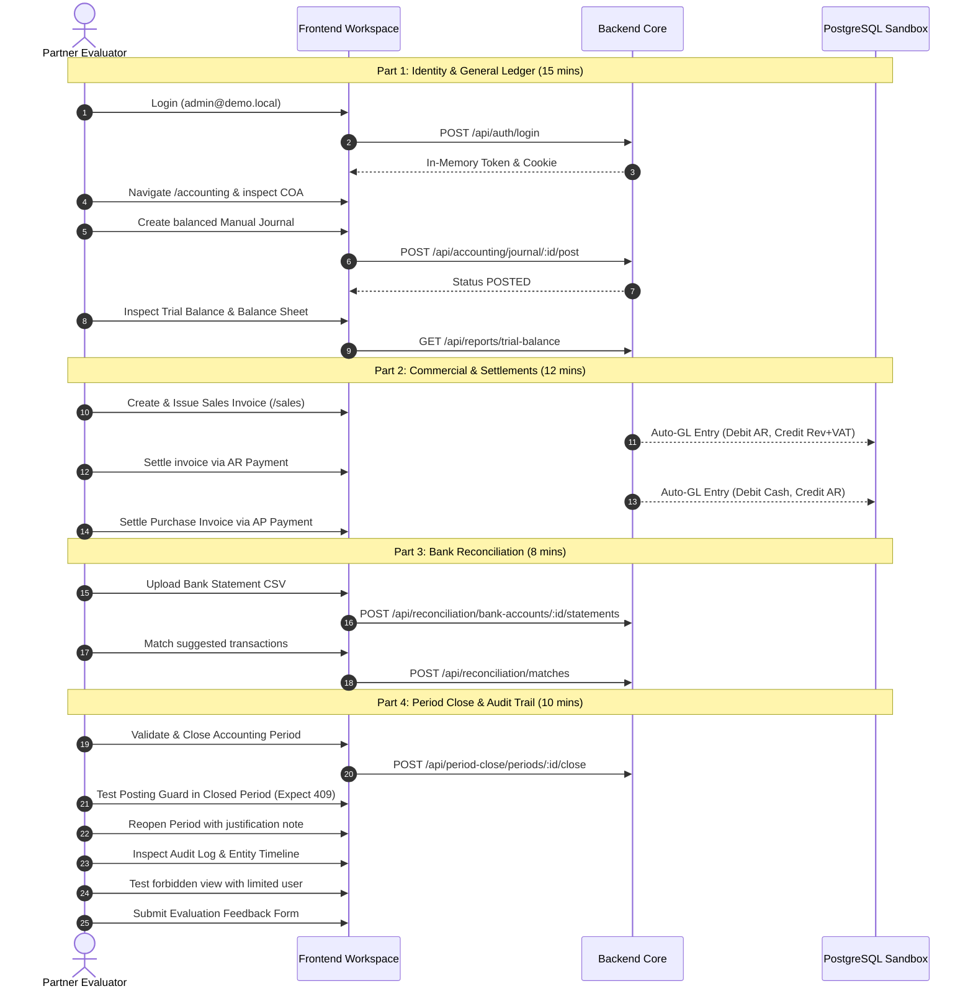
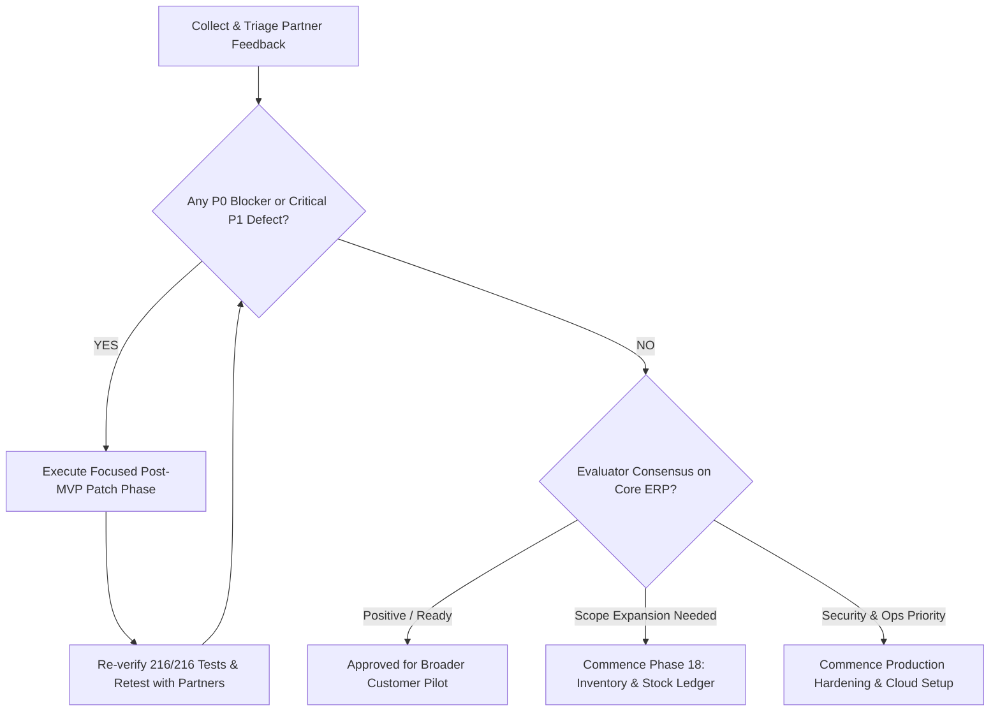

# Phase 17A: Partner Trial Launch Preparation Plan

> Status: **Documentation-Only Planning Phase**. The Financial ERP MVP milestone is formally closed (Phase 16A). This phase defines the operational launch preparation plan for controlled partner trials. Zero backend code, frontend code, database schema models, migrations, tests, RBAC seed catalogs, deployment files, or README edits belong to this phase.

---

## 1. Purpose

The purpose of Phase 17A is to establish an end-to-end operational launch preparation plan for controlled external partner evaluations of the **Financial ERP Minimum Viable Product (MVP)**.

Having achieved full closure in Phase 16A with 216 passing automated tests, verified migrations, standardized permission gates, and an operator runbook, the focus now transitions to:
- Preparing an isolated, safe evaluation sandbox.
- Curating realistic synthetic demonstration datasets.
- Configuring evaluation persona accounts and access credentials.
- Equipping partners with a guided 45-minute evaluation script.
- Enforcing strict launch controls, risk mitigations, and structured feedback collection workflows.

> [!IMPORTANT]
> **Strict Operational Boundary**:
> - This plan does **not** represent product expansion or the addition of new business domains.
> - This is **not** a production deployment or public commercial release.
> - All testing occurs exclusively in a segregated sandbox environment using 100% synthetic data.

---

## 2. Launch Objectives

The controlled partner trial launch aims to achieve six primary objectives:

1. **Core Accounting Workflow Validation**: Allow certified accountants, financial controllers, and business managers to evaluate day-to-day operations (Chart of Accounts, balanced journal entries, financial statements, invoicing, and settlements).
2. **Actionable Feedback Harvesting**: Systematically collect objective data on workflow ergonomics, navigation clarity, terminology appropriateness, and edge-case handling.
3. **Role-Based Access Control (RBAC) Assessment**: Verify that granular permission gating and graceful Access Denied boundaries protect financial data without causing operational confusion.
4. **Statement & Reconciliation Utility**: Confirm that the read-only Trial Balance, Income Statement, Balance Sheet, and CSV statement reconciliation workflows meet professional accounting expectations.
5. **Period Close & Audit Trust**: Demonstrate the tamper-proof nature of closed periods (`assertPeriodIsOpen`) and the audit trail viewer (`/admin/audit-logs`) to build auditor confidence.
6. **Blocker Identification**: Detect and isolate any functional blockers (P0/P1) prior to considering broader pilot customer rollouts or subsequent roadmap domains (such as inventory stock ledgers).

---

## 3. Trial Scope

### In-Scope (Available for Partner Evaluation):
- **Authentication & Multi-Tenant Isolation**: Secure credential login, in-memory token lifecycle, HttpOnly refresh cookies, company isolation (`companyId`).
- **Dashboard & Navigation**: Live health check card (`/api/health`) and role-gated navigation cards.
- **Chart of Accounts (COA)**: 5 standard account classes, normal balance enforcement (`DEBIT` vs. `CREDIT`), deletion conflict safeguards.
- **Manual Journal Entries**: Real-time debit/credit equality check, `DRAFT` &rarr; `POSTED` lifecycle, draft cancellation.
- **Financial Statements**: Read-only Trial Balance, Income Statement, and Balance Sheet with string-based decimal precision.
- **Commercial Invoicing**: Sales invoices (`ISSUED`) and Purchase invoices (`RECEIVED`) with 15% VAT and automated GL posting.
- **AR / AP Payments**: Customer receipts and supplier disbursements with overpayment protection (`409 Conflict`).
- **Bank Reconciliation**: CSV statement ingestion, SHA-256 duplicate detection, suggestion engine, manual match/unmatch, unmatched reports.
- **Period Close & Fiscal Closing**: Pre-close validation, closed period posting guards (`409 Conflict`), reopen with mandatory justification, fiscal year closing.
- **Centralized Audit Trail**: Activity log viewer at `/admin/audit-logs`, multi-factor filtering, before/after diffs, and export preview record estimation.
- **Partner Feedback Collection**: Structured feedback capture and severity triage.

### Out-of-Scope (Explicitly Deferred):
- ❌ **Inventory & Stock Ledger**: Physical stock levels, bin tracking, multi-warehouse transfers, and inventory GL cost-of-goods-sold valuation (FIFO/average).
- ❌ **Payroll & Human Resources**: Employee directory, salary computations, GOSI contributions, end-of-service, and WPS compliance files.
- ❌ **Manufacturing & Assembly**: Bill of Materials (BOM), work orders, and job costing.
- ❌ **Fixed Assets & Depreciation**: Asset register, depreciation schedules, and asset disposal.
- ❌ **Budgeting & Cost Centers**: Budget vs. actual variance analysis and department cost tracking.
- ❌ **Multi-Currency Revaluation**: FX rate tables and foreign exchange gain/loss calculations.
- ❌ **Live Bank Feeds**: Open Banking aggregator APIs (reconciliation uses standard CSV files).
- ❌ **Real Binary File Exports**: Automated streaming or generation of physical PDF, Excel, or CSV report files.
- ❌ **Native Mobile Applications**: iOS and Android native applications.
- ❌ **Production Certification**: Public production deployment, high-concurrency stress testing, SOC2, or third-party penetration testing.
- ❌ **ZATCA Phase 2 E-Invoicing**: Cryptographic signing, CSID generation, and clearance portal transmission.

---

## 4. Sandbox Environment Requirements

To ensure complete safety and evaluation integrity, the trial sandbox must adhere to the following specifications:

1. **Segregated Sandbox Instance**:
   - Deployed on a dedicated staging machine or isolated container network.
   - Completely disconnected from development test databases and any production environments.
2. **Synthetic-Only PostgreSQL Database**:
   - Dedicated PostgreSQL database instance (e.g., `erp_sandbox`).
   - Zero real corporate financial data, customer PII, or real banking details.
3. **Pristine Codebase Deployment**:
   - Deployed strictly from the verified `main` branch HEAD (`7ecdc8598c027acd3245f51fbed7fa79577e589e` or later).
   - Clean compilation outputs for both NestJS backend (`dist/`) and Next.js frontend (`.next/`).
4. **Environment Variables Hardening**:
   - Independent `JWT_ACCESS_SECRET` and `JWT_REFRESH_SECRET` generated specifically for the sandbox.
   - `NODE_ENV=production` set on the sandbox runtime to emulate realistic security and caching behaviors.
   - External mail, SMS, and webhook notification services disabled or routed to a local mock sink (e.g., MailHog).
5. **File Upload Restrictions**:
   - Statement upload endpoint strictly restricted to synthetic CSV files up to 2MB in size.
6. **Logging & Diagnostics**:
   - Audit logging enabled across all business operations.
   - Application error logging enabled with sensitive parameter masking (`maskSensitiveData`).
7. **Snapshot & Reset Protocol**:
   - Database backup snapshot created immediately after demo data seeding (`erp_sandbox_baseline.sql`).
   - Rapid reset script allowing operators to restore the clean sandbox state between partner evaluation cohorts in under 2 minutes.

---

## 5. Demo Data Requirements

A pre-packaged, cohesive demonstration organization must be pre-seeded into the sandbox:

1. **Organization Profile**:
   - Legal Name: `شركة المجد للتجارة والخدمات المحدودة (Al-Majd Trading & Services Co. Ltd.)`
   - Company ID: Generated UUID (e.g., `company-demo-sandbox`)
   - Country: `SA` (Saudi Arabia)
   - Currency: `SAR` (Saudi Riyal)
   - Tax Identification Number: `300000000000003` (Synthetic ZATCA Test TIN)
2. **Chart of Accounts (COA)**:
   - Standard 4-digit hierarchical tree with mapped default accounts:
     - `1101`: Bank Primary Account (Alinma / مصرف الإنماء)
     - `1102`: Petty Cash (صندوق النثرية)
     - `1201`: Accounts Receivable (الذمم المدينة - العملاء)
     - `2101`: Accounts Payable (الذمم الدائنة - الموردون)
     - `2201`: VAT Output Tax Payable (ضريبة القيمة المضافة للمبيعات 15%)
     - `1202`: VAT Input Tax Receivable (ضريبة القيمة المضافة للمشتريات 15%)
     - `3101`: Paid-in Capital (رأس المال)
     - `3201`: Retained Earnings (الأرباح المبقاة)
     - `4101`: Commercial Sales Revenue (إيرادات المبيعات التجارية)
     - `4201`: Consulting & Services Revenue (إيرادات الخدمات والاستشارات)
     - `5101`: General & Administrative Expenses (مصروفات إدارية وعمومية)
     - `5102`: Office Rent & Utilities (إيجار ومرافق)
3. **Fiscal Calendar**:
   - Active Fiscal Year: Current Year (`2026`) with 12 monthly accounting periods.
   - Monthly Periods: Months 1–8 set to `CLOSED` (to demonstrate historical closed periods); Month 9 set to `OPEN` (active trial period); Months 10–12 set to `OPEN`.
4. **Master Data Profiles**:
   - 3 Synthetic Customers (e.g., `مؤسسة الأفق التقنية`, `شركة الرياض للمقاولات`, `مكتب النور للاستشارات`).
   - 3 Synthetic Suppliers (e.g., `شركة التوريدات المكتبية`, `مؤسسة الاتصالات والشبكات`, `شركة الخدمات اللوجستية`).
   - 4 Commercial Service & Product Items (e.g., `خدمات استشارية مالية`, `تراخيص برمجية`, `أجهزة شبكات`, `صيانة دورية`).
5. **Sample Invoices & Payments**:
   - 2 Issued Sales Invoices (1 fully paid via AR Payment, 1 partially paid to test remaining balance).
   - 2 Received Purchase Invoices (1 fully paid via AP Payment, 1 unpaid).
6. **Bank Account & Reconciliation Dataset**:
   - Primary Bank Account configured with synthetic IBAN (`SA44ALIN0000000000000000`).
   - Pre-loaded ERP payments awaiting statement reconciliation.
   - 2 Sample CSV Statement Files:
     - `sample_statement_valid.csv`: Contains 1 exact match, 1 suggested match, and 1 unmatched bank transaction.
     - `sample_statement_duplicate.csv`: Exact duplicate of the valid statement to test SHA-256 rejection.
7. **Pre-Seeded Audit Log History**:
   - Realistic initial log events (`AUTH_LOGIN`, `ACCOUNT_CREATED`, `SALES_INVOICE_ISSUED`, `PERIOD_CLOSED`) to provide an active, populated audit viewer upon first login.

---

## 6. Trial User Roles and Access Matrix

Partners will be provisioned with designated test accounts representing distinct operational personas:

| User Role | Persona & Purpose | Suggested Permission Catalog | Workspaces to Evaluate | Access Restrictions |
|---|---|---|---|---|
| **Trial Admin** | System administrator & general evaluator | All permissions (`users.*`, `accounting.*`, `sales.*`, `purchases.*`, `reconciliation.*`, `period_close.*`, `audit_log.*`) | Full platform access across all routes | None (Unrestricted within sandbox company) |
| **Accountant** | Financial controller & primary accounting user | `accounting.read`, `accounting.accounts.*`, `accounting.journal.*`, `gl_accounts.read`, `gl_journal.read`, `reports.read`, `reconciliation.read`, `reconciliation.write`, `reconciliation.import`, `period_close.read`, `period_close.close`, `period_close.reopen`, `audit_log.read` | `/accounting`, `/accounting/gl`, `/accounting/reports`, `/accounting/reconciliation`, `/accounting/period-close`, `/admin/audit-logs` | Cannot manage user accounts or modify company settings |
| **Auditor / Viewer** | Compliance reviewer & internal auditor | `gl_accounts.read`, `gl_journal.read`, `reports.read`, `reconciliation.read`, `period_close.read`, `audit_log.read`, `audit_log.export` | Read-only ledger, statements, period status, and audit logs | All write, post, cancel, close, reopen, and match buttons are hidden or disabled |
| **Sales Operator** | Commercial billing & AR collections | `sales.read`, `sales.create`, `sales.update`, `sales.delete`, `sales.issue`, `sales.cancel`, `ar_payments.read`, `ar_payments.write` | `/sales`, `/dashboard` | Forbidden from `/accounting`, period close, and audit logs |
| **Purchases Operator** | Supplier billing & AP disbursements | `purchases.read`, `purchases.create`, `purchases.update`, `purchases.delete`, `purchases.receive`, `purchases.cancel`, `ap_payments.read`, `ap_payments.write` | `/purchases`, `/dashboard` | Forbidden from `/accounting`, period close, and audit logs |
| **Reconciliation Clerk**| Bank operations & statement matching | `reconciliation.read`, `reconciliation.write`, `reconciliation.import`, `gl_journal.read` | `/accounting/reconciliation`, `/dashboard` | Forbidden from closing periods or posting manual journals |
| **Read-Only Executive** | Business owner / General manager | `reports.read`, `sales.read`, `purchases.read`, `accounting.read` | `/dashboard`, `/reports`, `/accounting/reports` | Purely observational access; cannot alter financial records |

---

## 7. Partner Trial Script (45-Minute Guided Evaluation)

Evaluators should follow this structured walkthrough to experience the full breadth of the Financial ERP MVP:



### Detailed Script Steps:
1. **Login & Dashboard (3 mins)**: Access `/login`, sign in with `admin@demo.local`, review user details and live `/api/health` status.
2. **Navigation & Permissions (2 mins)**: Inspect top navigation bar; confirm module access cards correspond to assigned administrative permissions.
3. **Chart of Accounts (3 mins)**: Open `/accounting`, browse account tree categories, create a new sub-account (`1103 - Petty Cash Branch`), verify automatic `DEBIT` normal balance.
4. **Manual Journal Entry (4 mins)**: Create a balanced draft journal entry (Debit Expense, Credit Bank), verify live balance indicator (`متوازن`), and click **ترحيل (Post)**.
5. **Financial Statements Inspection (3 mins)**: Open `/accounting/reports`, switch between Trial Balance, Income Statement, and Balance Sheet; confirm debit/credit sums balance.
6. **Sales Invoice Lifecycle (4 mins)**: Navigate to `/sales`, create a new invoice for `1,000.00 SAR` + 15% VAT (`150.00 SAR`), issue the invoice, and confirm automated GL posting.
7. **Purchase Invoice Lifecycle (4 mins)**: Navigate to `/purchases`, create and receive a supplier invoice for `500.00 SAR` + 15% VAT, and confirm automated GL posting.
8. **AR / AP Settlements (4 mins)**: Record an AR Payment against the sales invoice and an AP Payment against the purchase invoice; verify remaining balances update to `0.00`.
9. **CSV Bank Statement Import (3 mins)**: Navigate to `/accounting/reconciliation`, select the bank account, upload `sample_statement_valid.csv`, and verify import statistics.
10. **Reconciliation Matching (3 mins)**: Review automated match suggestions (`EXACT`), click **مطابقة (Match)**, and verify unmatched reports update.
11. **Period Close Workflow (4 mins)**: Open `/accounting/period-close`, run **التحقق من الفترة (Validate)**, and execute **إقفال الفترة (Close Period)**.
12. **Posting Guard Test (2 mins)**: Return to `/accounting`, attempt to post a manual journal dated within the closed period, and verify the server blocks posting with `409 Conflict`.
13. **Period Reopen (2 mins)**: Reopen the period with a required justification note (`"Reopened for partner audit verification"`).
14. **Fiscal Year Close Validation (2 mins)**: Review fiscal year close requirements; confirm retained earnings isolation notice.
15. **Audit Trail Inspection (3 mins)**: Open `/admin/audit-logs`, filter by `ACCOUNTING` category, inspect event details, view entity timeline, and open export preview.
16. **Access Denied Verification (2 mins)**: Log in as `cashier@demo.local`, attempt direct navigation to `/accounting`, and verify the polite Arabic Access Denied card.
17. **Submit Feedback (2 mins)**: Complete the partner trial evaluation template.

---

## 8. Launch Checklist

Operators must complete and sign off on this checklist prior to sending evaluation invitations:

- [ ] **Git Baseline Confirmed**: Branch is `main`, commit is `7ecdc8598c027acd3245f51fbed7fa79577e589e` or later, working tree is clean.
- [ ] **Prisma Generation**: Run `pnpm --filter @erp/backend prisma:generate` (0 schema drift).
- [ ] **Database Migrations**: Run `pnpm --filter @erp/backend prisma:migrate:deploy` (14 migrations deployed, 0 pending).
- [ ] **Backend Compilation**: Run `pnpm --filter @erp/backend build` (NestJS compiles with 0 errors).
- [ ] **E2E Test Baseline**: Run `pnpm --filter @erp/backend test:e2e` (**216/216 passing tests**).
- [ ] **Frontend Static Build**: Run `pnpm --filter @erp/frontend build` (20 static routes compiled).
- [ ] **Sandbox Provisioned**: Sandbox database isolated from development and production environments.
- [ ] **Health Endpoint Verified**: GET `/api/health` returns `200 OK` with database ping.
- [ ] **Demo Tenant Initialized**: Organization profile, Chart of Accounts, customers, suppliers, and bank account seeded.
- [ ] **Persona Accounts Verified**: Logins tested for Admin, Accountant, Auditor, and Cashier.
- [ ] **Synthetic Data Hygiene Verified**: Zero live banking records, corporate ledgers, or customer PII in the database.
- [ ] **CSV Sample Files Prepared**: `sample_statement_valid.csv` and duplicate test file formatted and tested.
- [ ] **Partner Pack Distributed**: Evaluators provided with sandbox URL, login credentials, evaluation script, and feedback form.
- [ ] **Support Channel Scheduled**: Dedicated technical support contact established for active evaluation hours.

---

## 9. Feedback Collection and Triage

To ensure that partner input directly informs subsequent development, feedback must be collected using a standardized schema and triaged against clear severity criteria.

### Standard Feedback Submission Fields:
- **Partner / Firm Name**: Name of the evaluating organization.
- **Evaluator Name & Role**: (e.g., Lead Financial Auditor / ERP Consultant).
- **Date & Time**: Timestamp of the evaluation session.
- **Environment URL**: Sandbox instance URL.
- **Workflow Evaluated**: Specific workflow tested (e.g., Manual Journal Entry, Period Close, Bank Reconciliation).
- **Result**: `PASS` (Fully functional) / `WARN` (Functional with minor friction) / `FAIL` (Blocked or incorrect).
- **Severity Classification**: `P0` / `P1` / `P2` / `P3`.
- **Steps to Reproduce**: Numbered sequence of user actions leading to the observation.
- **Expected Behavior**: What the accounting or ERP standard dictates.
- **Actual Behavior**: What the application rendered or returned.
- **Screenshot / Video Link**: Evidence attachment reference.
- **Business / Accounting Impact**: Consequence for financial reporting or daily accounting operations.
- **Suggested Improvement**: Actionable recommendation.
- **Must-Have Before Broader Pilot?**: `YES` (Mandatory prerequisite) / `NO` (Desirable enhancement).

### Severity Classification Matrix:

| Severity Level | Definition | Impact on Trial | Resolution Target |
|:---:|---|---|---|
| **P0 (Blocker)** | System crash, unhandled runtime exception, database corruption, double-entry imbalance, or security bypass. | Halts evaluation of affected workflow immediately. | Triage within 4 hours; patch or workaround deployed before trial continues. |
| **P1 (Critical)** | Core accounting workflow cannot be completed; expected operation fails with no available workaround. | High impact; evaluators skip affected step. | Investigated within 24 hours; prioritized for immediate stabilization phase. |
| **P2 (Important)** | Workflow completes successfully, but error messaging is ambiguous, validation UX is confusing, or display formatting is suboptimal. | Moderate friction; evaluation continues. | Logged in backlog; addressed during post-trial stabilization. |
| **P3 (Nice-to-Have)** | Minor cosmetic enhancement, layout polish, localization phrasing preference, or out-of-scope feature request. | Minimal impact. | Documented for future product roadmap prioritization. |

---

## 10. Launch Control Rules

The partner evaluation trial is governed by strict operational rules:

1. **Time-Boxed Duration**: Each partner evaluation cohort is limited to **7 to 14 calendar days**.
2. **Limited Partner Cohort**: Trials are restricted to 3–5 pre-screened partner firms (accounting practices, CFO advisory firms, and regional ERP consultants).
3. **Synthetic Data Mandate**: Evaluators are strictly prohibited from entering genuine customer details, live invoices, or real bank account statements.
4. **No Financial Reliance**: Partners must formally acknowledge that sandbox trial outputs, financial reports, and tax calculations are strictly for evaluation and must not be used for actual statutory filing or corporate tax returns.
5. **Code Freeze During Active Trials**: No new product features or breaking schema migrations will be deployed during an active evaluation window. Only verified P0/P1 stabilization patches may be deployed.
6. **Mandatory Post-Trial Review**: All submitted feedback must be reviewed and categorized before deciding whether to open subsequent roadmap phases.

---

## 11. Success Criteria

The partner trial launch will be deemed **successful** if all of the following criteria are satisfied:

- [x] **Zero P0 Blockers**: No data corruption, double-entry mathematical imbalance, or unhandled server crashes encountered during evaluation.
- [x] **Core Workflow Completion**: Evaluators successfully complete the 45-minute guided script across at least 80% of scheduled sessions.
- [x] **Accounting Integrity Trust**: Accountants and auditors express confidence in the mathematical consistency of financial statements and the enforcement of period-close posting guards.
- [x] **Intuitive Reconciliation**: Evaluators confirm that the bank reconciliation CSV ingestion, duplicate detection, and match suggestions are easy to understand.
- [x] **Audit Trail Approval**: Reviewers confirm that the centralized audit log viewer provides transparent traceability with reliable redaction of sensitive credentials.
- [x] **Acceptance of Boundaries**: Evaluators agree that current exclusions (inventory stock ledger, payroll, direct file exports) are appropriate for an initial Financial ERP MVP.
- [x] **Decisive Feedback Delivery**: Evaluators provide clear, actionable feedback supporting a definitive go/no-go decision for broader customer pilots.

---

## 12. Risk Register & Mitigations

| Risk ID | Identified Risk | Likelihood | Impact | Mitigation Strategy |
|:---:|---|:---:|:---:|---|
| **R-01** | Partner attempts to upload real company bank statements or customer PII. | Medium | High | Display prominent sandbox warning banner; enforce non-disclosure and synthetic data guidelines in trial pack; sanitize uploaded CSVs. |
| **R-02** | Evaluator experiences confusion over granular permission keys. | Medium | Medium | Provide pre-configured persona accounts with pre-assigned roles; do not require partners to configure custom roles from scratch. |
| **R-03** | Incomplete or cleared demo data causes broken workflows. | Low | High | Maintain `erp_sandbox_baseline.sql` snapshot; provide 2-minute automated database reset script. |
| **R-04** | Evaluator tests on unsupported mobile phone viewport. | Medium | Low | State clearly in evaluation guide that complex accounting workspaces are desktop- and tablet-optimized. |
| **R-05** | Partner expects out-of-scope modules (e.g., Inventory Stock Ledger or Payroll). | High | Medium | Explicitly highlight out-of-scope boundaries during the initial briefing and within the trial pack documentation. |
| **R-06** | Chart of Accounts mapping mismatch prevents automated GL posting. | Low | High | Pre-seed default accounts and verify sales/purchases/settlement posting paths prior to trial launch. |
| **R-07** | Bank statement CSV formatting discrepancies cause parser rejection. | Medium | Medium | Distribute standard pre-tested sample CSV templates (`sample_statement_valid.csv`) with the trial pack. |
| **R-08** | Unstructured or overly broad feedback delays roadmap prioritization. | Medium | Medium | Mandate the structured feedback form with clear severity ratings (P0–P3) and "Must-have before pilot" checkboxes. |

---

## 13. Post-Trial Decision Framework

Following the completion of partner evaluation cohorts, the engineering and product team will evaluate aggregated feedback against this decision tree:



1. **Pathway A (Stabilization Patch Required)**: If any P0 blockers or critical P1 accounting defects are discovered, launch an immediate stabilization sub-phase to patch the issues before expanding pilot access.
2. **Pathway B (Pilot Expansion Approved)**: If core financial workflows pass cleanly and evaluators validate the system's readiness, approve the Financial ERP MVP for wider, multi-organization pilot trials.
3. **Pathway C (Inventory Domain Commencement)**: If partners confirm core accounting strength but highlight inventory stock valuation as the primary commercial requirement, commence **Phase 18: Inventory Core & Warehouse Stock Ledger**.
4. **Pathway D (Production Hardening Commencement)**: If commercial partners require deployment certification, commence infrastructure hardening, automated backups, and cloud deployment pipelines.

---

## 14. Recommended Sub-Phases for Phase 17A

To execute launch preparation systematically, Phase 17A is divided into the following sequential sub-phases:

### Sub-Phase 17A-B-1: Sandbox Environment Checklist
- **Focus**: Document sandbox server specifications, database provisioning, environment variables, security configurations, and automated reset scripts.
- **Allowed Changes**: `docs/PHASE_17A_B1_SANDBOX_CHECKLIST.md` only.
- **Suggested Commit**: `docs(phase-17a): add sandbox environment checklist`

### Sub-Phase 17A-B-2: Demo Data Preparation Guide
- **Focus**: Document synthetic company parameters, Chart of Accounts mapping, sample customer/vendor profiles, demo invoices, and sample bank statement CSVs.
- **Allowed Changes**: `docs/PHASE_17A_B2_DEMO_DATA_GUIDE.md` only.
- **Suggested Commit**: `docs(phase-17a): add demo data preparation guide`

### Sub-Phase 17A-B-3: Trial Access Pack and Feedback Form
- **Focus**: Prepare partner-facing evaluation invitation pack, user persona credentials guide, 45-minute evaluation script, and standardized feedback submission template.
- **Allowed Changes**: `docs/PHASE_17A_B3_TRIAL_ACCESS_PACK.md` only.
- **Suggested Commit**: `docs(phase-17a): add trial access pack and feedback template`

### Sub-Phase 17A-C-1: Launch Readiness Verification
- **Focus**: Execute complete, clean verification pass across backend, frontend, migrations, and automated tests to certify sandbox deployment readiness. Verification-only phase.
- **Allowed Changes**: None (verification only).
- **Suggested Commit**: None.

### Sub-Phase 17A-C-2: Trial Launch Closure Notes
- **Focus**: Finalize Phase 17A documentation and certify that all partner trial launch preparation prerequisites are complete.
- **Allowed Changes**: `docs/PHASE_17A_C2_TRIAL_LAUNCH_CLOSURE.md` only.
- **Suggested Commit**: `docs(phase-17a): close partner trial launch preparation phase`

---

## 15. Verification Expectations

For any future verification steps or environment checks within Phase 17A, the following command baseline must be maintained:

```bash
# Prisma Client Generation
pnpm --filter @erp/backend prisma:generate

# Database Migration Check
pnpm --filter @erp/backend prisma:migrate:deploy

# Backend Strict Compilation
pnpm --filter @erp/backend build

# Automated E2E Regression Suite
pnpm --filter @erp/backend test:e2e

# Frontend Production Build
pnpm --filter @erp/frontend build
```

**Expected Baseline**:
- Prisma Generate: PASS (`@prisma/client v5.22.0`)
- Database Migrations: PASS (14 migrations, 0 pending)
- Backend Build: PASS (0 TypeScript errors)
- Backend E2E: PASS (**216 passed, 216 total** across `reports.e2e-spec.ts` and `app.e2e-spec.ts`)
- Frontend Build: PASS (20 static pages prerendered)

---

## 16. Plan Closure Checklist

Prior to committing this launch preparation plan:
- [x] Run `git diff --name-only` and `git status --short -uall`.
- [x] Confirm that **only** `docs/PHASE_17A_PARTNER_TRIAL_LAUNCH_PLAN.md` appears.
- [x] Confirm no modifications to backend, frontend, schema, migrations, tests, RBAC seeds, package files, or deployment configs.
- [x] Execute explicit git add and commit:
  ```bash
  git add docs/PHASE_17A_PARTNER_TRIAL_LAUNCH_PLAN.md
  git commit -m "docs(phase-17a): add partner trial launch plan"
  git push origin main
  ```
- [x] Verify post-push commit hash and clean working tree status.
