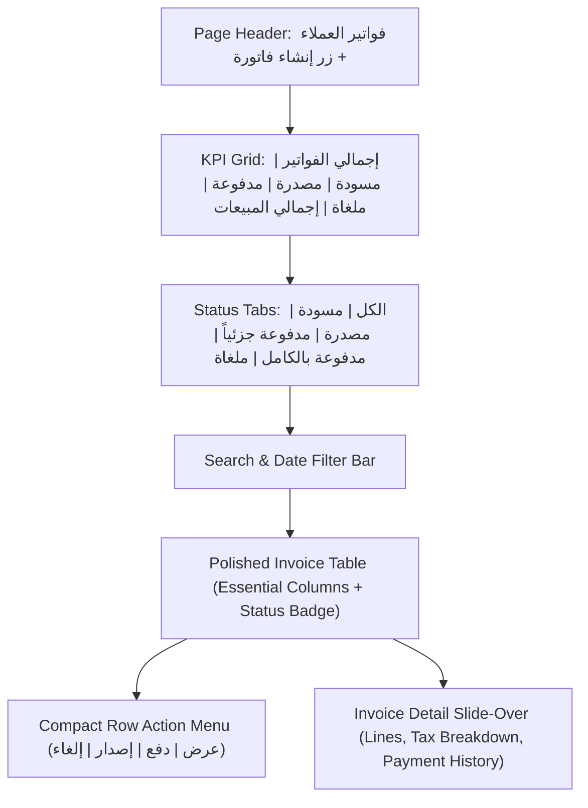

# Phase 18A: Partner Demo UX Polish Plan

> Status: **Documentation-Only Planning Phase**. The Financial ERP MVP milestone is formally closed (Phase 16A) and launch preparation is verified (Phase 17A). This document establishes a focused, controlled frontend UX/UI polish plan designed to elevate the visual hierarchy, modern SaaS aesthetic, and Arabic/RTL presentation for upcoming partner demonstrations. Zero backend code, frontend code, database schema models, migrations, automated tests, RBAC seed catalogs, deployment automation files, or README files are modified as part of this deliverable.

---

## 1. Purpose

The purpose of Phase 18A is to establish an actionable, controlled design and implementation plan for polishing the user interface and user experience of the Financial ERP MVP prior to partner evaluations and live demonstrations.

### Operational Boundaries & Strategic Focus:
- **Visual & Usability Polish Only**: Focus exclusively on frontend presentation, information architecture, visual hierarchy, status visibility, and Arabic/RTL comfort.
- **Zero Feature Expansion**: No new functional business domains (e.g., Inventory Stock Ledger, Payroll, HR, Manufacturing, Fixed Assets, Budgeting) are introduced in this phase.
- **Zero Backend Logic Alterations**: All NestJS controllers, services, Prisma models, database migrations, and financial accounting invariants remain 100% frozen.
- **Zero Authoritative Calculation on Frontend**: All accounting figures, VAT balances, debit/credit totals, and ledger records remain strictly sourced from backend API responses.
- **Zero Security or Permission Regression**: Existing RBAC guards and permission gates must be strictly preserved across all polished views.

---

## 2. Current UI Problem Statement

While the Financial ERP MVP is functionally rock-solid—featuring 216 passing automated tests, immutable period closing, balanced double-entry GL posting, and audit logging—the visual presentation exhibits clear areas for modernization:

1. **Table-Heavy & Database-Centric**: Major workspaces (such as `/sales`, `/purchases`, and `/accounting/reconciliation`) present dense data tables directly above the fold without contextual orientation.
2. **Weak Visual Hierarchy**: Page titles, metric summaries, and action controls lack clear separation and contrast, causing screens to resemble raw administrative database viewers.
3. **Repeated Tiny Row Action Buttons**: Rows in list views feature multiple inline action buttons ("تعديل", "إصدار", "دفع", "إلغاء", "حذف"), cluttering the table surface and increasing misclick risks.
4. **Absence of Summary KPI Cards**: Evaluators cannot immediately gauge the total transaction volume, outstanding receivables, open vendor balances, or draft counts without manually scanning rows.
5. **Lack of Workflow Status Tabs**: Users must interact with native `<select>` dropdowns to filter by status rather than having intuitive one-click segmented tabs (*الكل*, *مسودة*, *مصدرة*, *مدفوعة*, *ملغاة*).
6. **Arabic / RTL Refinement Opportunities**: Certain date-times, numbers, and monetary symbols lack consistent RTL alignment, leading to occasional visual discordance.
7. **Risk of Premature Partner Judgment**: Evaluators and C-suite stakeholders frequently assess product maturity based on first visual impressions before appreciating the depth of backend architectural controls.

---

## 3. UX Principles for Partner Demo

All frontend enhancements executed under Phase 18A will adhere to the following twelve design principles:

1. **Arabic-First & Native RTL Flow**: Design primarily for right-to-left layout ergonomics, ensuring typography, icon orientations, and data alignments feel natural to Arabic business users.
2. **Modern SaaS Aesthetic**: Employ clean card-based surfaces, subtle borders, intentional whitespace, refined border radiuses, and crisp typography.
3. **KPIs Before Dense Grids**: Display summary metric cards above data tables so executives and controllers immediately comprehend business context.
4. **Prominent Page Headers & Subtitles**: Standardize every workspace with a clear title, descriptive subtitle, and primary call-to-action button.
5. **One-Click Segmented Status Tabs**: Replace dropdown status filters with prominent tab bars showing counts for each lifecycle stage.
6. **Grouped Action Menus**: Consolidate repetitive row buttons into clean, accessible action menus or dedicated detail drawers.
7. **Standardized Empty, Loading, and Error States**: Provide polite, helpful visual illustrations and guidance when lists are empty or requests fail.
8. **Explicit Destructive Action Styling**: Highlight cancellations and voiding actions in muted rose/red with required confirmation dialogs.
9. **Zero Frontend Accounting Math**: Total balances, VAT calculations, and debits/credits must continue to originate from backend API responses as string-based decimals.
10. **Preserve Granular RBAC Gates**: Action buttons and navigation links must remain conditionally rendered based on the evaluator's assigned permissions.
11. **Responsive Desktop-First Ergonomics**: Optimize primarily for standard desktop viewports (1280px to 1920px) utilized in finance departments.
12. **Build and Test Integrity**: Ensure every UI enhancement compiles cleanly with `pnpm --filter @erp/frontend build` and preserves all 216 backend E2E tests.

---

## 4. Design System Direction

To ensure visual consistency across all modules without introducing external UI component libraries, the following standard Tailwind CSS design patterns will be established:

### Component Conventions:

- **Page Header Pattern**:
  ```tsx
  <div className="flex flex-col sm:flex-row sm:items-center sm:justify-between gap-4 mb-8">
    <div>
      <h1 className="text-2xl font-bold text-slate-900 tracking-tight">عنوان الصفحة</h1>
      <p className="text-sm text-slate-500 mt-1">وصف موجز للمهام وسير العمل في هذا القسم</p>
    </div>
    <div className="flex items-center gap-3">{/* Primary Action Buttons */}</div>
  </div>
  ```

- **KPI Metric Cards**:
  - Compact cards with subtle background fills, light border, small label, bold formatted number, and optional trend/status badge.
  - Placed in 4-column or 5-column responsive grids (`grid grid-cols-2 md:grid-cols-4 gap-4 mb-6`).

- **Status Badges**:
  - Consistent semantic color coding across all modules:
    - `POSTED` / `ISSUED` / `PAID` / `OPEN`: Emerald/Green (`bg-emerald-50 text-emerald-700 border-emerald-200`)
    - `DRAFT` / `PENDING` / `PARTIALLY_PAID`: Amber (`bg-amber-50 text-amber-700 border-amber-200`)
    - `CANCELLED` / `CLOSED` / `FAILED`: Rose/Red (`bg-rose-50 text-rose-700 border-rose-200`)
    - `SYSTEM` / `NEUTRAL` / `AUDIT`: Slate/Indigo (`bg-slate-100 text-slate-700 border-slate-200`)

- **Segmented Status Tabs**:
  - Horizontal pill-style tab list with active indicator:
    ```tsx
    <nav className="flex space-x-1 space-x-reverse border-b border-slate-200 pb-2 mb-4">
      <button className="px-3 py-1.5 text-sm font-medium rounded-lg bg-blue-50 text-blue-700">الكل (24)</button>
      <button className="px-3 py-1.5 text-sm font-medium text-slate-500 hover:text-slate-700">مسودة (3)</button>
    </nav>
    ```

- **Search & Filter Bar Pattern**:
  - Unified toolbar combining search input, date range picker, and secondary filters with consistent height (`h-10`) and focus states.

- **Detail Drawer / Slide-Over**:
  - Clean slide-over panel for viewing full invoice breakdowns, accounting debit/credit distributions, and settlement histories without navigating away.

- **Empty State Pattern**:
  - Centered icon, informative title, explanatory subtitle, and optional creation button.

---

## 5. High-Priority Pages to Polish

The visual enhancement effort will target eight core workspaces:

| Priority | Page / Workspace | Current UI Weakness | Desired Partner Demo Impression | Key Polish Elements | Permissions to Preserve |
| :---: | :--- | :--- | :--- | :--- | :--- |
| **1** | **Sales Invoices** (`/sales`) | Dense 10-column table; inline repetitive row buttons; no top-level metrics. | Executive commercial sales workspace with invoice lifecycle visibility. | KPI cards, status tabs, search toolbar, cleaner table, actions dropdown, details drawer. | `sales.invoice.read`, `sales.invoice.create`, `sales.invoice.issue`, `sales.invoice.cancel` |
| **2** | **Dashboard** (`/dashboard`) | Minimal navigation grid; limited live business statistics; text-heavy. | Executive command center showing real-time operational financial health. | Financial KPI summary, period status card, quick action buttons, module navigation cards. | Role-gated module visibility |
| **3** | **Purchases Invoices** (`/purchases`) | Mirrors sales table density; plain status badges; cluttered payment actions. | Professional vendor payable desk with settlement tracking clarity. | AP KPI cards, bill status tabs, supplier filter, structured bill receipt drawer. | `purchases.invoice.read`, `purchases.invoice.create`, `purchases.invoice.receive` |
| **4** | **Accounting Main** (`/accounting`) | Disjointed links; plain tree view of accounts; journal entry form feels plain. | Authoritative General Ledger console reflecting professional double-entry rigour. | COA class summary cards, journal entry balance live indicator, posted entry viewer. | `accounting.accounts.read`, `accounting.journal.read`, `accounting.journal.post` |
| **5** | **Financial Reports** (`/reports`) | Plain data tables; plain date inputs; lacks visual separation of statement sections. | Board-ready financial statements (Trial Balance, P&L, Balance Sheet) with decimal clarity. | Statement selector tabs, date controls card, statement summary banner, read-only tag. | `report.trial_balance`, `report.income_statement`, `report.balance_sheet` |
| **6** | **Bank Reconciliation** (`/accounting/reconciliation`) | Statement upload area and transaction tables placed flatly; suggestions lack prominence. | Smart treasury reconciliation console with high-confidence match highlights. | Bank account summary card, prominent CSV drop zone, suggestion confidence cards, match badges. | `reconciliation.read`, `reconciliation.import`, `reconciliation.match` |
| **7** | **Period Close** (`/accounting/period-close`) | Plain text status; validation checklist looks like basic alert; reopen reason plain. | Tamper-proof compliance control center with clear fiscal milestones. | Visual period timeline, interactive pre-close audit card, locked period visual shield. | `period_close.read`, `period_close.close`, `period_close.reopen` |
| **8** | **Audit Logs** (`/admin/audit-logs`) | Standard admin table; JSON diffs can overwhelm; filter controls plain. | Regulatory-grade compliance audit trail with instant before/after visualization. | Compliance summary banner, category filter chips, visual before/after diff inspector, export notice. | `audit_log.read`, `audit_log.export` |

---

## 6. Sales Invoice Page Redesign Target (First Implementation Target)

Because the `/sales` workspace is the primary screen evaluated by commercial and accounting partners during initial onboarding, it represents the **first implementation target**:



### Specific Target UI Specifications:

1. **Header Section**:
   - Title: `فواتير المبيعات (Sales Invoices)`
   - Subtitle: `إدارة وتتبع فواتير العملاء ومتابعة التحصيلات والترحيل المحاسبي التلقائي`
   - Primary Action: `+ إنشاء فاتورة جديدة` (rendered only if `sales.invoice.create` is granted).
2. **Top KPI Metrics Strip** (Calculated safely from current list data):
   - **إجمالي الفواتير**: Total count of invoices.
   - **المسودات (Drafts)**: Count of invoices in `DRAFT`.
   - **فواتير بانتظار السداد**: Count of `ISSUED` invoices with remaining balance > 0.
   - **مسددة بالكامل (Paid)**: Count of settled invoices.
   - **إجمالي المبيعات (SAR)**: Display-only sum of active invoice totals.
3. **Status Filter Tabs**:
   - Quick filter buttons: *الكل*, *مسودة*, *صادرة*, *مدفوعة*, *ملغاة*.
4. **Enhanced Search & Filtering**:
   - Full-width search bar for invoice number, customer name, and notes.
   - Date range selector and invoice type selector (Standard vs. POS).
5. **Modernized Table Grid**:
   - Display core columns: رقم الفاتورة, العميل, تاريخ الإصدار, الحالة, الإجمالي, الرصيد المستحق, الإجراءات.
   - Move timestamps and secondary IDs to the detail drawer.
   - Replace 5 individual row buttons with an accessible action menu ("عرض التفاصيل", "تسجيل دفعة", "إصدار", "إلغاء").
6. **Invoice Details Drawer**:
   - Slide-over panel presenting complete invoice line items, 15% VAT breakdown, customer credit terms, and settled payments ledger.

---

## 7. Dashboard Redesign Target

The main application dashboard at `/dashboard` serves as the entry point for all partner sessions:

- **Welcome & Enterprise Header**: Displays the organization name (`Al-Majd Trading & Services Co. Ltd.`), user role badge, and active fiscal period (`سبتمبر 2026`).
- **Live System Health Card**: Prominently shows the `/api/health` status (`ONLINE`), database latency, and API version.
- **Executive Financial Metrics Grid**:
  - *مبيعات الشهر (Sales This Month)*
  - *الذمم المدينة المستحقة (Outstanding Receivables)*
  - *مشتريات الشهر (Purchases This Month)*
  - *عمليات بنكية بانتظار المطابقة (Pending Bank Matches)*
  - *حالة الفترة المالية (Current Period Status - OPEN)*
- **Role-Gated Workflow Hub**:
  - Grouped navigation cards with icons, descriptions, and active permission badges for Accounting, Invoicing, Settlements, Reconciliation, Period Close, and Audit Trail.

---

## 8. Reports Page Polish Target

The reporting workspace at `/reports` must instill immediate confidence in statutory accountants:

- **Report Selector Header**: Intuitive tab selector between *ميزان المراجعة (Trial Balance)*, *قائمة الدخل (Income Statement)*, and *الميزانية العمومية (Balance Sheet)*.
- **Date & Period Control Bar**: Clear period selection with single-click fiscal month presets.
- **Executive Summary Card**: Shows total debits/credits balance equality (0.00 SAR variance indicator).
- **Mathematical Decimal Integrity**: Strictly render API-provided decimal strings; avoid floating-point math on the frontend.
- **Export Notice**: Prominently display a helpful notice explaining that reports are rendered for on-screen inspection with physical exports planned for subsequent phases.

---

## 9. Reconciliation Page Polish Target

The bank statement reconciliation interface at `/accounting/reconciliation` will be organized into three distinct visual tiers:

1. **Bank Account Overview Card**: Shows the linked GL asset account (`1101`), bank name, masked account number, and current reconciled balance.
2. **Statement Dropzone & Import Area**: Refined drag-and-drop zone with explicit 2MB limits and clear duplicate file error messaging.
3. **Smart Matching Workspace**:
   - *Split-screen / Dual-Card View*: Unmatched bank transactions on the right; candidate ERP ledger payments on the left.
   - *Suggestion Confidence Badges*: Highlight high-confidence matches with matching score pills (`تطابق تام 100%`, `تطابق مقترح 85%`).
   - *Single-Click Match & Unmatch*: Clear, reassuring feedback upon match creation or decoupling.

---

## 10. Period Close Page Polish Target

The period close workspace at `/accounting/period-close` will emphasize control and compliance:

- **Fiscal Period Timeline**: Visual progress stepper showing closed months (Jan–Aug), active month (Sep), and future months (Oct–Dec).
- **Pre-Close Verification Card**: Interactive checklist validating balanced journal entries, open drafts warning, and period cutoff dates.
- **Shielded Close / Reopen Dialogs**: Clear warning prompts emphasizing that closed periods reject new transactional postings (`409 Conflict`).
- **Mandatory Justification Input**: Polished text area requiring controller reason input for period reopening with audit trail preview.

---

## 11. Audit Logs Page Polish Target

The compliance trail viewer at `/admin/audit-logs` will provide clean forensic visibility:

- **Compliance Banner**: Explains immutable ledger logging and automatic credential redaction.
- **Multi-Factor Filter Bar**: Compact filter chips for Date Range, Category (`AUTH`, `GL`, `SALES`, `RECONCILIATION`, `PERIOD_CLOSE`), and User.
- **Visual JSON State Inspector**: Side-by-side or tabbed Before / After difference viewer highlighting modified values in green/amber with masked credentials (`[REDACTED]`).
- **Export Preview Modal**: Interactive count estimator without disk writes.

---

## 12. Permission and Safety Requirements

All UX polish implementations must strictly enforce the existing security architecture:

1. **Preserve All RBAC Evaluators**: Use `hasPermission(...)` guards across all primary actions, action menus, and modal dialogs.
2. **Zero Unauthorized Actions**: If a user lacks `sales.invoice.issue`, the issue button/menu item must not be rendered.
3. **Graceful Access Denied Screens**: Unauthorized deep links must continue to display the standard `403 Access Denied` UI.
4. **Zero Client-Side Unredaction**: The frontend must never attempt to reveal masked passwords or tokens.
5. **No Local Storage of Sensitive Records**: In-memory token management must remain strictly preserved.

---

## 13. Technical Constraints & Invariants

To safeguard repository stability throughout Phase 18, the following constraints are strictly enforced:

- **Frontend-Only Scope**: Changes in subsequent sub-phases are strictly confined to `frontend/src/*`.
- **Zero Backend or API Modifications**: No endpoints, DTOs, controllers, or database queries may be modified.
- **Zero Dependencies Added**: No new npm packages may be added to `package.json`. All styling must use standard Tailwind CSS classes and existing utilities (`clsx`, `tailwind-merge`).
- **Zero Schema Migrations**: `schema.prisma` and `prisma/migrations` are strictly frozen.
- **Zero Accounting Math on Frontend**: Do not recompute financial statements or invoice totals on the client; always render backend-computed numbers.
- **Automated Regression Baseline**: The backend E2E suite must continue to pass with exactly **216 passed, 216 total** tests.

---

## 14. Recommended Implementation Sub-Phases

The UX polish plan will be executed in modular, verifiable sub-phases:

### Sub-Phase 18A-B-1: Design System & Shared UI Patterns
- **Objective**: Establish shared layout utilities, KPI card wrappers, status badge helpers, and drawer components in `frontend/src/components/ui/`.
- **Allowed Changes**: Frontend shared components only.
- **Suggested Commit**: `feat(phase-18a): add shared ui design system patterns`

### Sub-Phase 18A-B-2: Sales Invoices Workspace UX Polish (First Target)
- **Objective**: Redesign `/sales` with top KPI cards, status filter tabs, search bar, cleaner table grid, compact action menus, and invoice details drawer.
- **Allowed Changes**: `frontend/src/app/sales/*`.
- **Suggested Commit**: `feat(phase-18a): polish sales invoice workspace`

### Sub-Phase 18A-B-3: Purchases & Payments Workspaces UX Polish
- **Objective**: Modernize `/purchases` and `/payments` with AP KPI metrics, bill status tabs, and settlement workflows.
- **Allowed Changes**: `frontend/src/app/purchases/*`, `frontend/src/app/payments/*`.
- **Suggested Commit**: `feat(phase-18a): polish purchases and payments workspaces`

### Sub-Phase 18A-B-4: Accounting & Reports Workspaces UX Polish
- **Objective**: Redesign `/accounting` and `/reports` with COA class cards, balanced journal indicators, and board-ready statement presentation.
- **Allowed Changes**: `frontend/src/app/accounting/*`, `frontend/src/app/reports/*`.
- **Suggested Commit**: `feat(phase-18a): polish accounting and reports workspaces`

### Sub-Phase 18A-B-5: Control & Audit Workspaces UX Polish
- **Objective**: Polish Reconciliation, Period Close, and Audit Trail viewers (`/accounting/reconciliation`, `/accounting/period-close`, `/admin/audit-logs`).
- **Allowed Changes**: Control and audit page files in `frontend/src/app/*`.
- **Suggested Commit**: `feat(phase-18a): polish control and audit workspaces`

### Sub-Phase 18A-C-1: UX Verification and Build Certification
- **Objective**: Execute end-to-end frontend build verification, visual inspection, and automated test pass. Verification-only phase.
- **Allowed Changes**: None (verification only).
- **Suggested Commit**: None.

### Sub-Phase 18A-C-2: Phase 18A Closure & Partner Demo Notes
- **Objective**: Finalize Phase 18A documentation and certify that all partner demo UX enhancements are complete.
- **Allowed Changes**: `docs/PHASE_18A_C2_UX_POLISH_CLOSURE.md` only.
- **Suggested Commit**: `docs(phase-18a): close partner demo ux polish phase`

---

## 15. Acceptance Criteria

The UX polish initiative will be declared successful when:

1. **Noticeable First Impression Leap**: Evaluators immediately perceive a modern, high-end SaaS platform.
2. **Sales Workspace De-cluttered**: The sales invoice page features KPI cards, status tabs, and clean action menus instead of raw database tables.
3. **Executive Dashboard Context**: The dashboard provides immediate visibility into monthly performance and system health.
4. **Natural Arabic / RTL Ergonomics**: Text alignment, number formatting, and component orientations feel native and legible.
5. **Zero Functional or Permission Regressions**: All 216 automated tests pass, and permission boundaries remain intact.
6. **Flawless Frontend Production Compilation**: `pnpm --filter @erp/frontend build` succeeds with zero TypeScript or lint errors.

---

## 16. Risks and Mitigations

| Identified Risk | Severity | Impact | Planned Mitigation |
| :--- | :---: | :--- | :--- |
| **UI Polish Alters Business Logic** | High | Unintended mutations to invoice state or payment processing | Confine changes strictly to JSX and Tailwind classes. Re-test existing workflows. |
| **Visual Inconsistency Across Pages** | Medium | Different pages look disjointed or adopt varying styles | Establish shared design system primitives in Sub-Phase 18A-B-1 before page redesigns. |
| **Scope Creep / Over-Polishing Delays Launch** | Medium | Excessive design iterations delay partner trial evaluation | Strictly limit scope to the eight prioritized pages; avoid speculative redesigns. |
| **Client-Side Financial Discrepancies** | High | UI calculates totals that diverge from general ledger entries | Strictly display backend-computed decimal strings; prohibit client-side recalculation. |
| **Permission Regression** | High | Action buttons render for unauthorized users | Mandatory review of `hasPermission` gates across all new action menus and modals. |

---

## 17. Verification Expectations for Future UX Phases

For all subsequent Phase 18 implementation sub-phases, the following verification baseline must be maintained:

```bash
# 1. Frontend Production Compilation Check
pnpm --filter @erp/frontend build

# 2. Automated E2E Regression Suite Verification
pnpm --filter @erp/backend test:e2e
```

**Expected Baseline**:
- Frontend Build: `PASS` (Clean compilation, zero static page generation errors).
- Backend E2E: `PASS` (**216 passed, 216 total** across `reports.e2e-spec.ts` and `app.e2e-spec.ts`).
- Working Tree: Clean after build checks.

---

## 18. Plan Closure Checklist

Prior to committing this UX polish plan:
- [x] Run `git diff --name-only` and `git status --short -uall`.
- [x] Confirm that **only** `docs/PHASE_18A_PARTNER_DEMO_UX_POLISH_PLAN.md` appears.
- [x] Confirm no modifications to backend, frontend, schema, migrations, tests, RBAC seeds, package files, or deployment configs.
- [x] Execute explicit git add and commit:
  ```bash
  git add docs/PHASE_18A_PARTNER_DEMO_UX_POLISH_PLAN.md
  git commit -m "docs(phase-18a): add partner demo ux polish plan"
  git push origin main
  ```
- [x] Verify post-push commit hash and clean working tree status.
